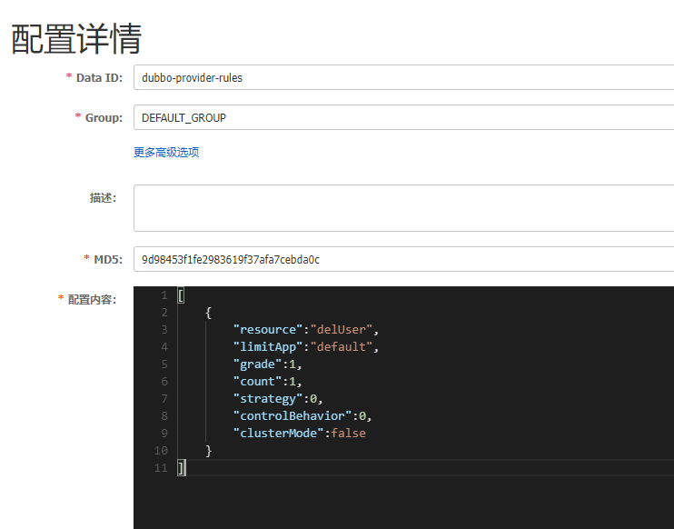

# 注册中心

## 服务注册
使用Nacos，需要添加相关的依赖。

```xml

<dependency>  
    <groupId>org.springframework.cloud</groupId>  
    <artifactId>spring-cloud-starter-bootstrap</artifactId>  
</dependency>  
<dependency>  
    <groupId>com.alibaba.cloud</groupId>  
    <artifactId>spring-cloud-starter-alibaba-nacos-discovery</artifactId> 
</dependency>
```

> 第一个依赖指：使用bootstrap代替application，实现配置。

> Spring Boot中有两种上下文配置，一种是bootstrap，另外一种是application。bootstrap是应用程序的父上下文，也就是说bootstrap加载优先于application。由于在加载远程配置之前，需要读取Nacos配置中心的服务地址信息，所以Nacos服务地址等属性配置需要放在bootstrap中。

所以还需要Dubbo相关依赖

```xml
<dependency>  
    <groupId>org.apache.dubbo</groupId>  
    <artifactId>dubbo-spring-boot-starter</artifactId>  
    <version>3.0.2.1</version>  
</dependency>
```

然后只需要去模块的配置文件，添加Nacos的地址和端口就可以把该模块或者说该服务注册到Nacos了。

```yml
dubbo:  
  registry:  
    address: nacos://localhost:8848  
  
spring:  
  application:  
    name: provider
```

## 服务发现

可以说就是服务消费者调用在Nacos注册过的服务。

参考[服务调用](服务.md##Nacos+Dubbo)

# 配置中心

需要依赖

```xml
<dependency>
    <groupId>com.alibaba.cloud</groupId>
    <artifactId>spring-cloud-starter-alibaba-nacos-config</artifactId>
</dependency>
```

我将配置中心里的配置文件分为两类。

一类为数据文件，即里面的数据被直接读取并使用在程序中。

另一类为规则文件，例如流控，熔断规则。并不直接把内容应用在程序中，但是也是作用于程序之上。

## 数据文件

### 怎么寻找远程的配置文件

在bootstarp配置文件中，表明要去读取哪个数据配置文件即可。

```yml
spring:
  application:
    name: payment-service
  profiles:
    active: dev
  cloud:
    nacos:
      config:
        server-addr: localhost:8848
        file-extension: yaml
```

奇怪的是，好像并没有写出配置文件的名称，只有配置中心的地址，端口和配置文件的格式。那么是怎么找到配置文件的？

当你没有在程序的配置文件中指明需要去Nacos调用的配置文件的名称时，它有一个默认的名称寻找的机制。

\${prefix}-\${spring.profiles.active}.\${file-extension}

+ prefix：远程配置文件的前缀，默认为spring.application.name。

    + 当然也可以自己设置。通过spring.cloud.nacos.config.prefix来配置。

+ spring.profiles.active：当前环境对应的profile。
    + 若未设置，则为空，相应的默认远程配置文件名称变为\${prefix}.\${file-extension}
+ file-extension：配置文件的数据格式或者说扩展名。
    + 未设置时，默认扩展名为properties。

所以上述配置去寻找的文件名为 payment-service-dev.yaml。所以需要在Nacos中创建一个同名的配置文件，格式为yaml。就可以读取到了。


### 怎么引用远程配置文件中的数据

假设上述数据文件中的配置为

```yml
info: aaa
```

直接使用${config.info}即可引用。

## 规则文件

因为规则需要读取后需要由Sentinel来实现限流和熔断。所以需要添加依赖。

```xml

# 启动sentienl所需
<dependency>  
    <groupId>com.alibaba.cloud</groupId>  
    <artifactId>spring-cloud-starter-alibaba-sentinel</artifactId>  
</dependency>

# sentinel使用Nacos存储的规则所需
<dependency>  
    <groupId>com.alibaba.csp</groupId>  
    <artifactId>sentinel-datasource-nacos</artifactId>  
</dependency>
```

### 流控规则



在程序的配置文件中进行读取。

```yml
dubbo:  
  registry:  
    address: nacos://localhost:8848  
  
spring:  
  application:  
    name: provider  
  cloud:  
    sentinel:  
      transport:  
        dashboard: localhost:8333  
      datasource:  
        ds:                                 # 名称任意，用于区分不同的规则 
          nacos:  
            username: nacos  
            password: nacos  
            server-addr: localhost:8848  
            data-id: dubbo-provider-rules   
            group-id: DEFAULT_GROUP  
            rule-type: flow                  # 规则类型：流控
            data-type: json                  # 规则格式：json
        ds2:  
          nacos:  
            username: nacos  
            password: nacos  
            server-addr: localhost:8848  
            data-id: dubbo-fusing-provider-rules  
            group-id: DEFAULT_GROUP  
            rule-type: degrade              # 规则类型：熔断
            data-type: json
```

[不同规则具体配置](Sentinel不同规则在Nacos中的配置.md)

# 其他功能

## 灰度配置

## 怎么寻找多个配置文件

## 命名空间、Group、DataID

