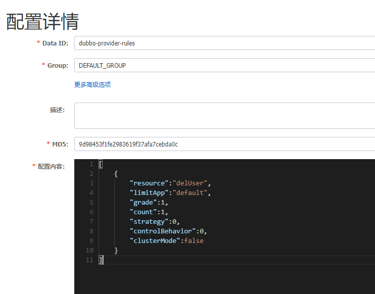

# 启动Nacos

-   单机模式 - 用于测试和单机试用。
-   集群模式 - 用于生产环境，确保高可用。
-   多集群模式 - 用于多数据中心场景。

github下载Nacos，并启动单机模式。默认端口号是8848

```shell
startup.cmd -m standalone
```

[Nacos](http://localhost:8848/nacos/#/login)，进入Nacos后台可视化界面。用户名和密码都是nacos。


# 注册中心

## 服务注册
使用Nacos，需要添加相关的依赖。

```xml

<dependency>  
    <groupId>org.springframework.cloud</groupId>  
    <artifactId>spring-cloud-starter-bootstrap</artifactId>  
</dependency>  
<dependency>  
    <groupId>com.alibaba.cloud</groupId>  
    <artifactId>spring-cloud-starter-alibaba-nacos-discovery</artifactId> 
</dependency>
```

> 第一个依赖指：使用bootstrap代替application，实现配置。

> Spring Boot中有两种上下文配置，一种是bootstrap，另外一种是application。bootstrap是应用程序的父上下文，也就是说bootstrap加载优先于application。由于在加载远程配置之前，需要读取Nacos配置中心的服务地址信息，所以Nacos服务地址等属性配置需要放在bootstrap中。

所以还需要Dubbo相关依赖

```xml
<dependency>  
    <groupId>org.apache.dubbo</groupId>  
    <artifactId>dubbo-spring-boot-starter</artifactId>  
    <version>3.0.2.1</version>  
</dependency>
```

然后只需要去模块的配置文件，添加Nacos的地址和端口就可以把该模块或者说该服务注册到Nacos了。

```yml
dubbo:  
  registry:  
    address: nacos://localhost:8848  
  
spring:  
  application:  
    name: provider
```

## 服务发现

可以说就是服务消费者调用在Nacos注册过的服务。

参考[服务调用](服务.md##Nacos+Dubbo)

# 配置中心

需要依赖

```xml
<dependency>
    <groupId>com.alibaba.cloud</groupId>
    <artifactId>spring-cloud-starter-alibaba-nacos-config</artifactId>
</dependency>
```

我将配置中心里的配置文件分为两类。

一类为数据文件，即里面的数据被直接读取并使用在程序中。

另一类为规则文件，例如流控，熔断规则。并不直接把内容应用在程序中，但是也是作用于程序之上。

## 数据文件

### 怎么寻找远程的配置文件

在bootstarp配置文件中，表明要去读取哪个数据配置文件即可。

```yml
spring:
  application:
    name: payment-service
  profiles:
    active: dev
  cloud:
    nacos:
      config:
        server-addr: localhost:8848
        file-extension: yaml
```

奇怪的是，好像并没有写出配置文件的名称，只有配置中心的地址，端口和配置文件的格式。那么是怎么找到配置文件的？

当你没有在程序的配置文件中指明需要去Nacos调用的配置文件的名称时，它有一个默认的名称寻找的机制。

\${prefix}-\${spring.profiles.active}.\${file-extension}

+ prefix：远程配置文件的前缀，默认为spring.application.name。

    + 当然也可以自己设置。通过spring.cloud.nacos.config.prefix来配置。

+ spring.profiles.active：当前环境对应的profile。
    + 若未设置，则为空，相应的默认远程配置文件名称变为\${prefix}.\${file-extension}
+ file-extension：配置文件的数据格式或者说扩展名。
    + 未设置时，默认扩展名为properties。

所以上述配置去寻找的文件名为 payment-service-dev.yaml。所以需要在Nacos中创建一个同名的配置文件，格式为yaml。就可以读取到了。


### 怎么引用远程配置文件中的数据

假设上述数据文件中的配置为

```yml
info: aaa
```

直接使用${config.info}即可引用。

或者

```java
@SpringBootApplication
public class ProviderApplication {
public static void main(String[] args) {
        ConfigurableApplicationContext applicationContext = SpringApplication.run(ProviderApplication.class, args);
        String userName = applicationContext.getEnvironment().getProperty("user.name");
        String userAge = applicationContext.getEnvironment().getProperty("user.age");
        System.err.println("user name :"+userName+"; age: "+userAge);
    }
}
```


### 多配置文件引用

#### 支持自定义扩展的 DATA ID 配置

```properties
spring.application.name=opensource-service-provider
spring.cloud.nacos.config.server-addr=127.0.0.1:8848
```

1、Data Id 在默认的组 DEFAULT_GROUP,不支持配置的动态刷新

```properties
spring.cloud.nacos.config.extension-configs[0].data-id=ext-config-common01.properties
```

2、Data Id 不在默认的组，不支持动态刷新

```properties
spring.cloud.nacos.config.extension-configs[1].data-id=ext-config-common02.properties
spring.cloud.nacos.config.extension-configs[1].group=GLOBALE_GROUP
```

3、Data Id 既不在默认的组，也支持动态刷新

```properties
spring.cloud.nacos.config.extension-configs[2].data-id=ext-config-common03.properties
spring.cloud.nacos.config.extension-configs[2].group=REFRESH_GROUP
spring.cloud.nacos.config.extension-configs[2].refresh=true
```

可以看到:

-   通过 `spring.cloud.nacos.config.extension-configs[n].data-id` 的配置方式来支持多个 Data Id 的配置。
    
-   通过 `spring.cloud.nacos.config.extension-configs[n].group` 的配置方式自定义 Data Id 所在的组，不明确配置的话，默认是 DEFAULT_GROUP。
    
-   通过 `spring.cloud.nacos.config.extension-configs[n].refresh` 的配置方式来控制该 Data Id 在配置变更时，是否支持应用中可动态刷新， 感知到最新的配置值。默认是不支持的。
    

> [!Note]
> 多个 Data Id 同时配置时，他的优先级关系是 `spring.cloud.nacos.config.extension-configs[n].data-id` 其中 n 的值越大，优先级越高。


> [!Note]
> `spring.cloud.nacos.config.extension-configs[n].data-id` 的值必须带文件扩展名，文件扩展名既可支持 properties，又可以支持 yaml/yml。 此时 `spring.cloud.nacos.config.file-extension` 的配置对自定义扩展配置的 Data Id 文件扩展名没有影响。

通过自定义扩展的 Data Id 配置，既可以解决多个应用间配置共享的问题，又可以支持一个应用有多个配置文件。

为了更加清晰的在多个应用间配置共享的 Data Id ，你可以通过以下的方式来配置：

+ 配置支持共享的 Data Id

```properties
spring.cloud.nacos.config.shared-configs[0].data-id=common.yaml
```

+ 配置 Data Id 所在分组，缺省默认 DEFAULT_GROUP

```properties
spring.cloud.nacos.config.shared-configs[0].group=GROUP_APP1
```

+ 配置Data Id 在配置变更时，是否动态刷新，缺省默认 false

```properties
spring.cloud.nacos.config.shared-configs[0].refresh=true
```

可以看到：

-   通过 `spring.cloud.nacos.config.shared-configs[n].data-id` 来支持多个共享 Data Id 的配置。
    
-   通过 `spring.cloud.nacos.config.shared-configs[n].group` 来配置自定义 Data Id 所在的组，不明确配置的话，默认是 DEFAULT_GROUP。
    
-   通过 `spring.cloud.nacos.config.shared-configs[n].refresh` 来控制该Data Id在配置变更时，是否支持应用中动态刷新，默认false。
    

#### 配置的优先级

Spring Cloud Alibaba Nacos Config 目前提供了三种配置能力从 Nacos 拉取相关的配置。

-   A: 通过 `spring.cloud.nacos.config.shared-configs[n].data-id` 支持多个共享 Data Id 的配置
    
-   B: 通过 `spring.cloud.nacos.config.extension-configs[n].data-id` 的方式支持多个扩展 Data Id 的配置
    
-   C: 通过内部相关规则(应用名、应用名+ Profile )自动生成相关的 Data Id 配置
    

当三种方式共同使用时，他们的一个优先级关系是:A < B < C

优先级高的配置会覆盖优先级低的配置。

## 规则文件

因为规则需要读取后需要由Sentinel来实现限流和熔断。所以需要添加依赖。

```xml

# 启动sentienl所需
<dependency>  
    <groupId>com.alibaba.cloud</groupId>  
    <artifactId>spring-cloud-starter-alibaba-sentinel</artifactId>  
</dependency>

# sentinel使用Nacos存储的规则所需
<dependency>  
    <groupId>com.alibaba.csp</groupId>  
    <artifactId>sentinel-datasource-nacos</artifactId>  
</dependency>
```

### 流控规则



在程序的配置文件中进行读取。

```yml
dubbo:  
  registry:  
    address: nacos://localhost:8848  
  
spring:  
  application:  
    name: provider  
  cloud:  
    sentinel:  
      transport:  
        dashboard: localhost:8333  
      datasource:  
        ds:                               # 名称任意，用于区分不同的规则 
          nacos:  
            username: nacos  
            password: nacos  
            server-addr: localhost:8848  
            data-id: dubbo-provider-rules   
            group-id: DEFAULT_GROUP  
            rule-type: flow                # 规则类型：流控
            data-type: json                # 规则格式：json
        ds2:  
          nacos:  
            username: nacos  
            password: nacos  
            server-addr: localhost:8848  
            data-id: dubbo-fusing-provider-rules  
            group-id: DEFAULT_GROUP  
            rule-type: degrade              # 规则类型：熔断
            data-type: json
```

[不同规则具体配置](Sentinel使用.md)

# 配置管理

## 配置列表

创建的配置在这里集中管理。

## 历史版本

查询指定Data ID和group的配置文件，可以一键回滚到之前的版本。

## 监听查询

Nacos提供配置订阅者即监听者查询能力，同时提供客户端当前配置的MD5校验值，以便帮助用户更好的检查配置变更是否推送到 Client 端。

# 服务管理

## 服务列表

展现注册的服务，以及它们的一些信息。

## 订阅者列表

可以查看特定的服务被其他哪些服务所订阅。

# 命名空间

Nacos 基于Namespace 帮助用户逻辑隔离多个命名空间，这可以帮助用户更好的管理测试、预发、生产等多环境服务和配置，让每个环境的同一个配置（如数据库数据源）可以定义不同的值。

当程序需要调用特定命名空间下的配置文件时，需要用namespace的id来确定命名空间而不是用命名空间的名称。通过命名空间-详情查看。

在Nacos通过三个维度来隔离配置文件。namespace-group-dataID。


