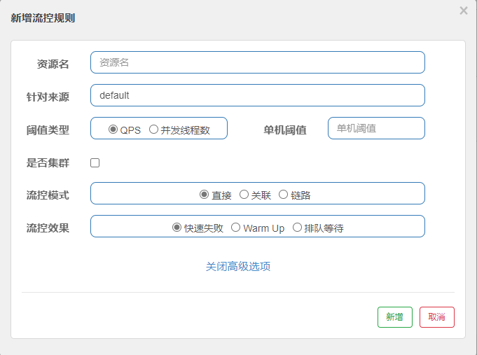

在程序配置文件中读取规则文件中设置type‘ = “”来告诉程序，这个规则文件是什么规则。

# 流控(flow)

|      Field      | 说明                                                         | 默认值                        |
| :-------------: | :----------------------------------------------------------- | :---------------------------- |
|    resource     | 资源名，资源名是限流规则的作用对象                           |                               |
|      count      | 限流阈值                                                     |                               |
|      grade      | 限流阈值类型，QPS 或线程数模式                               | QPS 模式                      |
|    limitApp     | 流控针对的调用来源                                           | `default`，代表不区分调用来源 |
|    strategy     | 调用关系限流策略：直接、链路、关联                           | 根据资源本身（直接）          |
| controlBehavior | 流控效果（直接拒绝 / 排队等待 / 慢启动模式），不支持按调用关系限流 | 直接拒绝                      |

+ resource：一般用路径名，也可以在代码中使用@SentinelResource(value = "name")对方法设定一个名称。
+ grade：
> 0：QPS。单纯的代表每秒的访问次数，只要访问次数到达一定的阈值，这进行限流操作
> 1：线程数。代表的是每秒内访问改api接口的线程数，如果该接口的操作比较长，当排队的线程数到达阈值的时候，进行限流操作，相反的如果接口的操作很快，即是没秒内的操作很快，同样不会进行限流操作
> QPS可以简单的理解为访问次数，但是线程数是和接口处理的快慢有关的。
+ limitApp：流控针对的调用来源。

> default：不区分
>
> {name}：填需要针对的来源
>
> other：需要先配一个{name}，非{name}中的来源就会被other接管

+ count：QPS或线程数的阈值。
+ strategy

> 0：直接。最简单，直接对resource生效流控规则。
> 1：关联。与另一个资源关联，另一个资源达到流控的QPS或线程数时，本资源被限流。
> 2：链路。

关联模式：

当两个资源之间具有资源争抢或者依赖关系的时候，这两个资源便具有了关联。比如对数据库同一个字段的读操作和写操作存在争抢，读的速度过高会影响写得速度，写的速度过高会影响读的速度。如果放任读写操作争抢资源，则争抢本身带来的开销会降低整体的吞吐量。可使用关联限流来避免具有关联关系的资源之间过度的争抢

应用场景：订单服务和支付服务。当支付服务达到阈值时，说明订单量已经太多了，就可以对订单服务进行限流，保证系统能够运行。

链路模式：

阈值统计时，只统计从指定资源进入当前资源的请求，是对请求来源的限流。

只有从入口资源请入的请求量才会计算到阈值内。

+ controlBehavior。到达阈值才会触发效果。

> 0：快速失败。在统计的时间内，达到阈值就失败，到下一个窗口时间再尝试。
>
> 1：warm-up。让通过的流量缓慢增加，在一定时间内逐渐增加到阈值上限，给冷系统一个预热的时间，避免冷系统被压垮的情况。从 阈值/coldFactor(默认为3) 开始，每过一个预热时长，允许请求量缓慢增加。
>
> 2：排队等待。此模式下必须为阈值类型必须为QPS。这种方式严格控制了请求通过的间隔时间，也即是让请求以均匀的速度通过。超出阈值的请求必须再等待时间之后才能被处理。

# 熔断(degrad)

# 系统保护(system)

# 热点(param-flow)

# 授权(authority)