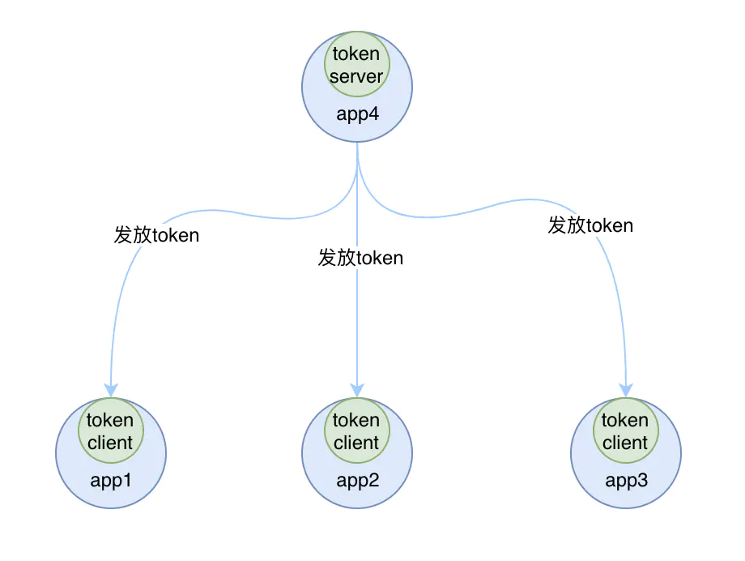

# 启动Sentinel

添加相关starter依赖即可。
```xml
<dependency>  
    <groupId>com.alibaba.cloud</groupId>  
    <artifactId>spring-cloud-starter-alibaba-sentinel</artifactId>  
</dependency>
```

同样的，Sentinel也提供了dashboard的可视化界面。

github下载sentinel-dashboard.jar

用下面命令运行

jdk17之前

```shell
java -Dserver.port=8333 -Dcsp.sentinel.dashboard.server=localhost:8333 -Dproject.name=sentinel-dashboard -jar sentinel-dashboard-1.8.4.jar
```

jdk17之后

```shell
java -Dserver.port=8333 -Dcsp.sentinel.dashboard.server=localhost:8333 -Dproject.name=sentinel-dashboard   -jar --add-exports=java.base/sun.net.util=ALL-UNNAMED sentinel-dashboard-1.8.4.jar
```

同时添加依赖

```xml
<!--实现sentinel和dashboard之间的信息传递，否则即使有限流熔断，在dashboard里也观察不到-->  
<dependency>  
    <groupId>com.alibaba.csp</groupId>  
    <artifactId>sentinel-transport-simple-http</artifactId>  
</dependency>
```

# 规则配置说明

针对规则属性作用进行说明，并给出在Nacos中进行持久化配置的属性。

在程序配置文件中读取规则文件中设置type‘ = “”来告诉程序，这个规则文件是什么规则。

## 流控(flow)


|       Field       | 说明                                                                | 默认值                        |
|:-----------------:|:------------------------------------------------------------------- |:----------------------------- |
|     resource      | 资源名，资源名是限流规则的作用对象                                  |                               |
|       count       | 限流阈值                                                            |                               |
|       grade       | 限流阈值类型，QPS 或线程数模式                                      | QPS 模式                      |
|     limitApp      | 流控针对的调用来源                                                  | `default`，代表不区分调用来源 |
|     strategy      | 调用关系限流策略：直接、链路、关联                                  | 根据资源本身（直接）          |
|    refResource    | 关联资源或入口资源                                                  | 在关联或链路策略下生效        |
|  controlBehavior  | 流控效果（直接拒绝 / 慢启动模式 / 排队等待 ），不支持按调用关系限流 | 直接拒绝                      |
| maxQueueingTimeMs | 最大排队时间，单位ms。仅在排队等待模式下生效。                      | 500ms                         |
|  warmUpPeriodSec  | 慢启动时间，单位s。仅在warm up模式下生效。                          | 10s                           |
|    clusterMode    | 是否集群                                                          | `false`                       |
|   thresholdType   | 代表集群限流阈值模式。0：单机均摊。1：全局阈值。                    | 0                             |

+ resource：一般用路径名，也可以在代码中使用@SentinelResource(value = "name")对方法设定一个名称。
+ grade：
> 0：QPS。单纯的代表每秒的访问次数，只要访问次数到达一定的阈值，这进行限流操作
> 1：线程数。代表的是每秒内访问改api接口的线程数，如果该接口的操作比较长，当排队的线程数到达阈值的时候，进行限流操作，相反的如果接口的操作很快，即是没秒内的操作很快，同样不会进行限流操作
> QPS可以简单的理解为访问次数，但是线程数是和接口处理的快慢有关的。

+ limitApp：流控针对的调用来源。

> default：不区分
>
> {name}：填需要针对的来源
>
> other：需要先配一个{name}，非{name}中的来源就会被other接管

+ count：QPS或线程数的阈值。

+ strategy

> 0：直接。最简单，直接对resource生效流控规则。
> 1：关联。与另一个资源关联，另一个资源达到流控的QPS或线程数时，本资源被限流。
> 2：链路。入口资源可以填写同一链路上的上级接口。从该链路过来的就计入阈值数量。

关联模式：

当两个资源之间具有资源争抢或者依赖关系的时候，这两个资源便具有了关联。比如对数据库同一个字段的读操作和写操作存在争抢，读的速度过高会影响写得速度，写的速度过高会影响读的速度。如果放任读写操作争抢资源，则争抢本身带来的开销会降低整体的吞吐量。可使用关联限流来避免具有关联关系的资源之间过度的争抢

应用场景：订单服务和支付服务。当支付服务达到阈值时，说明订单量已经太多了，就可以对订单服务进行限流，保证系统能够运行。

链路模式：

阈值统计时，只统计从指定资源进入当前资源的请求，是对请求来源的限流。

只有从入口资源请入的请求量才会计算到阈值内。

+ controlBehavior。到达阈值才会触发效果。

> 0：快速失败。在统计的时间内，达到阈值就失败，到下一个窗口时间再尝试。
>
> 1：warm-up。让通过的流量缓慢增加，在一定时间内逐渐增加到阈值上限，给冷系统一个预热的时间，避免冷系统被压垮的情况。从 阈值/coldFactor(默认为3) 开始，每过一个预热时长，允许请求量缓慢增加。
>
> 2：排队等待。此模式下必须为阈值类型必须为QPS。这种方式严格控制了请求通过的间隔时间，也即是让请求以均匀的速度通过。超出阈值的请求必须再等待时间之后才能被处理。

+ clusterMode
    + 关于集群的介绍，专门开了一块。

## 熔断(degrade)


|       Field        | 说明                                                                                     | 默认值     |
|:------------------:|:---------------------------------------------------------------------------------------- |:---------- |
|      resource      | 资源名，即规则的作用对象                                                                   |            |
|       grade        | 熔断策略，支持慢调用比例/异常比例/异常数策略                                                 | 慢调用比例 |
|       count        | 慢调用比例模式下为慢调用临界 RT（超出该值计为慢调用）；异常比例/异常数模式下为对应的阈值         |            |
|     timeWindow     | 熔断时长，单位为 s。                                                                       | 5s         |
|  minRequestAmount  | 熔断触发的最小请求数，请求数小于该值时即使异常比率超出阈值也不会熔断（1.7.0 引入）              | 5          |
|   statIntervalMs   | 统计时长（单位为 ms），如 60\*1000 代表分钟级（1.8.0 引入），默认1000ms。                     | 1000 ms    |
| slowRatioThreshold | 慢调用比例阈值，仅慢调用比例模式有效（1.8.0 引入）                                           |            |

+ resource：一般用路径名，也可以在代码中使用@SentinelResource(value = "name")对方法设定一个名称。

+ grade
    + 0：慢调用比例。在统计时长内，满足最小请求数的情况下，超出最大响应时间的比例超过阈值，就触发熔断。
    + 1：异常比例。在统计时长内，满足最小请求数的情况下，出现异常的比例超出阈值，就触发熔断。
    + 2：异常数。在统计时长内，异常数量超出阈值，就触发熔断。

+ count
    + 阈值。根据不同的策略，阈值有不同的含义。
    + 慢调用比例策略：RT，最大响应时间。
    + 异常比例，异常数策略：比例阈值或数阈值。

+ timeWindow
    + 熔断时长，s。当系统熔断后，经过熔断时长，会进行试探。如果下一次请求正常，就会结束熔断，若依然触发熔断策略，则继续熔断。

+ minRequestAmount
    + 最小请求数。小于该值时，即使比例超出阈值也不会熔断。

+ statIntervalMs
    + 统计时长。

+ slowRatioThreshold
    + 慢调用比例阈值。仅慢调用比例模式有效。[0.0~1.0]

## 系统保护(system)

相比熔断，流控更注重某种资源相比，系统保护则是对系统的整体监控。

Sentinel 系统自适应限流从整体维度对应用入口流量进行控制，结合应用的 Load、CPU 使用率、总体平均 RT、入口 QPS 和并发线程数等几个维度的监控指标，通过自适应的流控策略，让系统的入口流量和系统的负载达到一个平衡，让系统尽可能跑在最大吞吐量的同时保证系统整体的稳定性。


|       Field       | 说明                                                         | 默认值      |
| :---------------: | :----------------------------------------------------------- | :---------- |
| highestSystemLoad | 仅对 Linux/Unix-like 机器生效，`load1` 触发值，用于触发自适应控制阶段 | -1 (不生效) |
|       avgRt       | 所有入口流量的平均响应时间，单位ms。                         | -1 (不生效) |
|     maxThread     | 入口流量的最大并发数                                         | -1 (不生效) |
|        qps        | 所有入口资源的 QPS                                           | -1 (不生效) |
|  highestCpuUsage  | 当前系统的 CPU 使用率（0.0-1.0）                             | -1 (不生效) |

Sentinel 在系统自适应保护的做法是，用 `load1` 作为启动控制流量的值，而允许通过的流量由处理请求的能力，即请求的响应时间以及当前系统正在处理的请求速率来决定。

## 热点(param-flow)

热点即经常访问的数据。很多时候我们希望统计某个热点数据中访问频次最高的 Top K 数据，并对其访问进行限制。比如：

- 商品 ID 为参数，统计一段时间内最常购买的商品 ID 并进行限制
- 用户 ID 为参数，针对一段时间内频繁访问的用户 ID 进行限制

热点参数限流会统计传入参数中的热点参数，并根据配置的限流阈值与模式，对包含热点参数的资源调用进行限流。热点参数限流可以看做是一种特殊的流量控制，仅对包含热点参数的资源调用生效。


|       属性        | 说明                                                         | 默认值   |
| :---------------: | :----------------------------------------------------------- | :------- |
|     resource      | 资源名，必填                                                 |          |
|       count       | 限流阈值，必填                                               |          |
|       grade       | 限流模式                                                     | QPS 模式 |
|   durationInSec   | 统计窗口时间长度（单位为秒），1.6.0 版本开始支持             | 1s       |
|  controlBehavior  | 流控效果（支持快速失败和匀速排队模式），1.6.0 版本开始支持   | 快速失败 |
| maxQueueingTimeMs | 最大排队等待时长（仅在匀速排队模式生效），1.6.0 版本开始支持 | 0ms      |
|     paramIdx      | 热点参数的索引，必填，对应 `SphU.entry(xxx, args)` 中的参数索引位置 |          |
| paramFlowItemList | 参数例外项，可以针对指定的参数值单独设置限流阈值，不受前面 `count` 阈值的限制。**仅支持基本类型和字符串类型** |          |
|    clusterMode    | 是否是集群参数流控规则                                       | `false`  |
|   clusterConfig   | 集群流控相关配置                                             |          |


## 授权(authority)


|   属性   |                  说明                  |
| :------: | :------------------------------------: |
| resource |              资源名，必填              |
| limitApp |          对应的黑名单或白名单          |
| strategy | 0：白名单，1：黑名单。默认是白名单模式 |


## 集群

### 什么是集群？

可以认为是一个应用的多个实例。

### 为什么需要集群流控

假如你的应用有多个实例，那么你设置了限流的规则之后，每一台应用的实例都会生效相同的流控规则。如下所示：


很显然，这不是一个很好的策略。存在以下问题

-   假设集群中有 10 台机器，我们给每台机器设置单机限流阈值为 10 qps，理想情况下整个集群的限流阈值就为 100 qps。不过实际情况下路由到每台机器的流量可能会不均匀，会导致总量没有到的情况下某些机器就开始限流。
-   每台单机实例只关心自己的阈值，对于整个系统的全局阈值大家都漠不关心，当我们希望为某个 api 设置一个总的 qps 时(就跟为 api 设置总的调用次数一样)，那这种单机模式的限流就无法满足条件了。


所以就需要用到集群流控，把多个实例看作是一个实例来进行限流的操作。当然热点规则也是限流的一种，规则也是通用的。

原理：需要被限流的声明为token client，设置一个token server来统计同一集群下token client的请求量，来判断是否达到阈值。

单机流控(相对于集群流控的说法)中只有一种身份，每个 sentinel 都是一个 token server。

需要注意的是，集群限流中的 token server 是单点的，一旦 token server 挂掉，那么集群限流就会退化成单机限流的模式。


两种阈值计算模式

+ 集群总体模式：限制整个集群的阈值不能超出，否则就限流。

+ 单机均摊模式：阈值等同于单机能够承受的限额，总阈值为单机阈值\*连接的token client数量，在机器经常变动的环境很适用。请求量超过总阈值就限流。

两种部署模式

+ 独立部署：单独启动一个token server来处理请求。如果server挂掉时，client就会退化成单机流控的模式。


+ 嵌入部署：选择一个应用实例作为server，当server挂掉时，可以选择其他的client去当server。




### 使用

要想使用集群限流功能，必须引入集群限流 client 相关依赖：

```xml
<dependency> 
    <groupId>com.alibaba.csp</groupId> 
    <artifactId>sentinel-cluster-client-default</artifactId> <version>1.8.4</version> 
</dependency>
```


### 规则配置

集群的配置属于流控的部分。相比流控的部分，额外多一些参数。

|          属性           |                         说明                         | 默认值 |
|:-----------------------:|:----------------------------------------------------:|:------:|
|       clusterMode       |                       是否集群                       | false  |
| fallbackToLocalWhenFail | 失败退化，如果 Token Server 不可用是否退化到单机限流 |  true  |
|          count          |                     还是表示阈值                     |        |


## 路由模式

在Sentinel启动命令，-jar后增加 -Dcsp.sentinel.add.type = 1即可。

### 路由规则(gw-flow) 

route维度

针对在Spring配置文件中配置的路由条目。

|         属性         |                           说明                            |                       默认值                       |
|:--------------------:|:---------------------------------------------------------:|:--------------------------------------------------:|
|       resource       |                         资源名称                          | 可以是网关中的route名称或者用户自定义的API分组名称 |
|     resourceMode     | 规则是针对Gateway的route还是用户在Sentinel中定义的API分组 |                       route                        |
|        grade         |                       限流指标维度                        |               与 限流 中的grade相同                |
|        count         |                         限流阈值                          |                                                    |
|     intervalSec      |                     统计时间窗口，s。                     |                         1s                         |
|   controlBehavior    |       流控效果，目前支持0：快速失败，1：匀速排队。        |                         0                          |
|        brust         |             应对突发请求时额外允许的请求数目              |                                                    |
| maxQueueingTimeoutMs |              排队模式下的最长排队时间，ms。               |   500                                                 |
|      paramItem       | 参数限流配置。不设置就会转换为流控规则，设置就转换为热点规则。                                                          |                                                    |

+ paramItem
    + parseStrategy
    来源IP
    任意Header
    任意URL参数
    Host
    + fieldName
    若提取策略选择Header模式或URL参数模式。
    需要指定对应的Header名称或URL参数名称。
    + pattern
    参数值的匹配模式。
    + matchStrategy
    参数值的匹配策略。
    精确匹配
    子串匹配
    正则匹配

### 自定义api分组规则(gw-api-group) 

Sentienl提供的API分组维度


## 多种规则存在时


# 注解支持

使用sentinel当然还提供了注解的方式。

## @SentinelResource 注解

> 注意：注解方式埋点不支持 private 方法。

`@SentinelResource` 用于定义资源，并提供可选的异常处理和 fallback 配置项。 `@SentinelResource` 注解包含以下属性：

-   `value`：资源名称，必需项（不能为空）

-   `entryType`：entry 类型，可选项（默认为 `EntryType.OUT`）

-   `blockHandler` / `blockHandlerClass`: `blockHandler` 对应处理 `BlockException` 的函数名称，可选项。blockHandler 函数访问范围需要是 `public`，返回类型需要与原方法相匹配，参数类型需要和原方法相匹配并且最后加一个额外的参数，类型为 `BlockException`。blockHandler 函数默认需要和原方法在同一个类中。若希望使用其他类的函数，则可以指定 `blockHandlerClass` 为对应的类的 `Class` 对象，注意对应的函数必需为 static 函数，否则无法解析。

-   `fallback`：fallback 函数名称，可选项，用于在抛出异常的时候提供 fallback 处理逻辑。fallback 函数可以针对所有类型的异常（除了 `exceptionsToIgnore` 里面排除掉的异常类型）进行处理。fallback 函数签名和位置要求：

    -   返回值类型必须与原函数返回值类型一致；
    
    -   方法参数列表需要和原函数一致，或者可以额外多一个 `Throwable` 类型的参数用于接收对应的异常。
    
    -   fallback 函数默认需要和原方法在同一个类中。若希望使用其他类的函数，则可以指定 `fallbackClass` 为对应的类的 `Class` 对象，注意对应的函数必需为 static 函数，否则无法解析。
    
-   `defaultFallback`（since 1.6.0）：默认的 fallback 函数名称，可选项，通常用于通用的 fallback 逻辑（即可以用于很多服务或方法）。默认 fallback 函数可以针对所以类型的异常（除了 `exceptionsToIgnore` 里面排除掉的异常类型）进行处理。若同时配置了 fallback 和 defaultFallback，则只有 fallback 会生效。defaultFallback 函数签名要求：

    -   返回值类型必须与原函数返回值类型一致；
    
    -   方法参数列表需要为空，或者可以额外多一个 `Throwable` 类型的参数用于接收对应的异常。
    
    -   defaultFallback 函数默认需要和原方法在同一个类中。若希望使用其他类的函数，则可以指定 `fallbackClass` 为对应的类的 `Class` 对象，注意对应的函数必需为 static 函数，否则无法解析。
    
-   `exceptionsToIgnore`（since 1.6.0）：用于指定哪些异常被排除掉，不会计入异常统计中，也不会进入 fallback 逻辑中，而是会原样抛出。

> 注：1.6.0 之前的版本 fallback 函数只针对降级异常（`DegradeException`）进行处理，**不能针对业务异常进行处理**。

特别地，若 blockHandler 和 fallback 都进行了配置，则被限流降级而抛出 `BlockException` 时只会进入 `blockHandler` 处理逻辑。若未配置 `blockHandler`、`fallback` 和 `defaultFallback`，则被限流降级时会将 `BlockException` **直接抛出**。

- fallback：若本接口出现未知异常，则调用fallback指定的接口。
- blockHandler：若本次访问被限流或服务降级，则调用blockHandler指定的接口。
