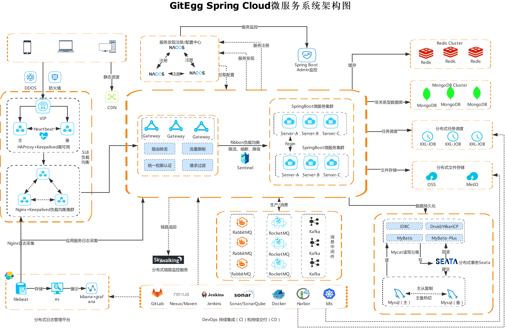
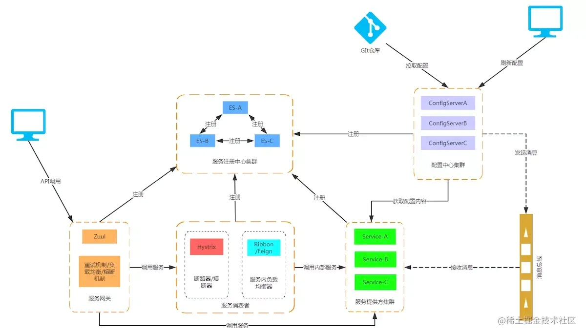

# 结构图

> 左上角为用户使用的部分，移动端或PC端。
>
> 通过负载均衡来分配请求去哪个服务器。
>
> * 试想，访问物理地址更近的服务器才能得到较快的反应速度。
>
> 再经过流控，负载均衡等才能调用到真正的服务。Consumer
>
> Consumer去调用Provider提供的服务来完成请求。
>
> 最后将结果返回才是我们看到的结果。

# 微服务各部分功能

## 服务网关

[网关](网关.md)

## 服务

[微服务中的服务](服务.md)

## 注册中心

[注册中心介绍](注册中心与配置中心.md#注册中心)

## 配置中心

[配置中心介绍](注册中心与配置中心.md#配置中心)

## 消息

[消息](消息总线.md)

## 数据持久化

[数据库](数据库.md)

 

