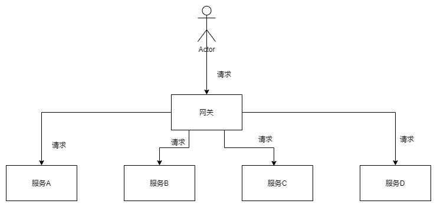

# 网关
为了解决用户客户端在调用微服务系统中的多个消费者工程接口时，需要维护非常多的消费者应用接口地址等信息，以及可能存在不同应用见的调用跨域等问题，微服务网关组件随即出现。网关作为用户客户端和微服务接口之间的一个统一路由及其他功能的组件，方便了用户客户端请求接口时不用去关注不同接口的地址路径等。只需要统一调用网关的服务即可。微服务网关为一个服务器服务，是系统对外的唯一入口。网关可以提供身份验证、监控、负载均衡、缓存、请求分片与管理、等功能。
网关就像是微服务的大门守卫一样，是连通外部客户端与内部微服务之间的一个桥梁。其主要功能有：

## 路由转发

API网关是内部微服务的对外唯一入口，所以外面全部的请求都会先发到这个API网关上，然后由API网关来根据不同的请求去路由到不同的微服务节点上。例如可以 根据路径 来转发、也可以 根据参数 来转发。并且由于内部微服务实例也会随着业务调整不停的变更，增加或者删除节点，API网关可以与服务注册模块进行协同工作，保证将外部请求转发到最合适的微服务实例上面去。

根据用户发送的请求，网关转发到相应的实例上来完成请求所需的功能。

## 负载均衡

因为API网关是内部微服务的单一入口，所以API网关在收到外部请求之后，还可以根据内部微服务每个实例的负荷情况进行动态的负载均衡调节。一旦内部的某个微服务实例负载很高，甚至是不能及时响应，则API网关就通过负载均衡策略减少或停止向这个实例转发请求。当所有的内部微服务实例都处理不过来的时候，API网关还可以采用限流或熔断的形式阻止外部请求，以保障整个系统的可用性。

[负载均衡详细介绍](./负载均衡.md)

## 安全认证

API网关就像是微服务的大门守卫，每一个请求进来之后，都必须先在API网关上进行身份验证，身份验证通过后才转发给后面的服务，转发的时候一般也会带上身份信息。同时API网关也需要对每一个请求进行安全性检查，例如参数的安全性、传输的安全性等等。

## 日志记录
因为所有的请求都需要走API网关，那么我们就可以在API网关上统一集中的记录下这些行为日志。这些日志既可以作为我们后续事件查询使用，也可以作为系统的性能监控使用。

## 数据转换
因为API网关对外是面向多种不同的客户端，不同的客户端所传输的数据类型可能是不一样的。因此API网关还需要具备数据转换的功能，将不同客户端传输进来的数据转换成同一种类型再转发给内部微服务上，这样，兼容了这些请求的多样性，保证了微服务的灵活性。

## 协议转换
内部的API可能是由很多种不同的协议实现的，比如HTTP、Dubbo、GRPC等，但对于用户来说其中很多都不是很友好，或者根本没法对外暴露，比如Dubbo服务，因此需要在网关层做一次协议转换，将用户的HTTP协议请求，在网关层转换成底层对应的协议，比如HTTP -> Dubbo, 但这里需要注意很多问题，比如参数类型，如果类型搞错了，导致转换出问题，而日志又不够详细的话，问题会很难定位。
