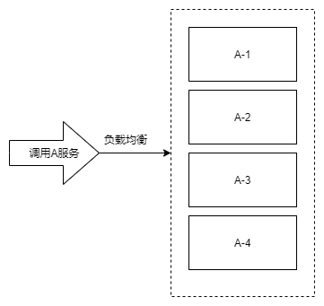

# 负载均衡

在一个微服务的结构中，一种服务的实现实例往往不只一个。

为什么一个服务需要多个实例？防止一个服务挂掉就会影响整个系统。

例如：我需要调用A服务来返回用户信息，但是A服务有四个实例，即调用A-1到A-4中的任意一个都可以达到目的。那么如何来选择调用哪个服务实例？这就是负载均衡所完成的事情。根据不同的负载均衡的规则来选择所要调用的实例。

负载均衡也在完成选择服务的事情，可以说负载均衡是路由选择的一种。

# 在Dubbo下的负载均衡规则

Dubbo实现负载均衡，一般是对服务的提供者来实现我们的集群管理，也就是负载均衡，然后服务的消费者在请求消费的时候，通过一定的算法进行寻址(权重)。

通过对服务提供者(@DubboService)和消费者(@DubboReference)都可以使用负载均衡，但只有在服务提供者上可以设置权重。

> 服务提供者才是对服务接口的实现，才可以对不同的实现设置不同的权重。
> 而服务消费者一端仅仅是对服务的引用。无法对每个实例设置具体的权重，所以不能设置。

Dubbo内置了五种策略，也可以自行扩展。

通过@DubboService(loadbalance = "name"，weight = "value")来设定负载均衡策略和对应权值。缺省为random策略。

## 1. random

说明：加权随机，按权重设置随机概率。

特点：调用次数越多，概率越向权重靠近。

缺点：当某一台机器上部署的提供者返回较慢时，但是没挂，请求就会卡在第二台机器上，久而久之，所有请求都卡在第二台上。

> 其他机器上的调用成功后，调用量就会增加，第二台由于返回很慢，还没调用成功，调用量就相对较少，为了满足权重的概率分布，请求就会更多的被分配到第二台机器上，久而久之，请求就全都卡在第二台机器上了。

## 2. roundrobin

说明：加权轮询，按照权值进行循环调用。

特点：每个实例按照权值被轮流调用。

缺点：同样存在慢的提供者累计请求的问题。

## 3. leastactive

说明：加权最少活跃调用优先。活跃数越低，越优先调用。相同活跃数进行加权随机。

> 活跃数 = 请求发送数 - 响应返回数。表示特定提供者的任务堆积量。活跃数越低说明堆积量越少，说明该节点处理能力越强。

特点：处理能力越强的节点处理更多的请求。

缺点：可能会造成请求大量集中于高性能节点。

## 4. shortestresponse

说明：加权最短响应优先。在最近一个滑动窗口中，响应时间越短，越优先调用。相同的响应时间进行加权随机。

> 响应时间 = 某个提供者在窗口时间内的平均响应时间。窗口时间默认为30s。

特点：使得响应越快的提供者会被分配更多的请求。

缺点：可能会造成请求大量集中于高性能节点。

## 5. consitenthash

说明：一致性Hash，相同的参数请求总是发送到同一提供者。

特点：当某一台提供者挂掉时，原本发往的请求会基于虚拟节点，平摊到其他提供者，不会引起剧烈变动。

> [!todo] 如何配置？
> 缺省状态下只对第一个参数Hash。如要修改，配置`<dubbo:parameter key = "hash.argumets" value = "0,1"`
> 缺省状态下用160份虚拟节点。如要修改，配置`<dubbo:parameter key  = "hash.nodes" value = "320"`
> 怎么在注解中配置？还是只能通过xml文件的方式？
