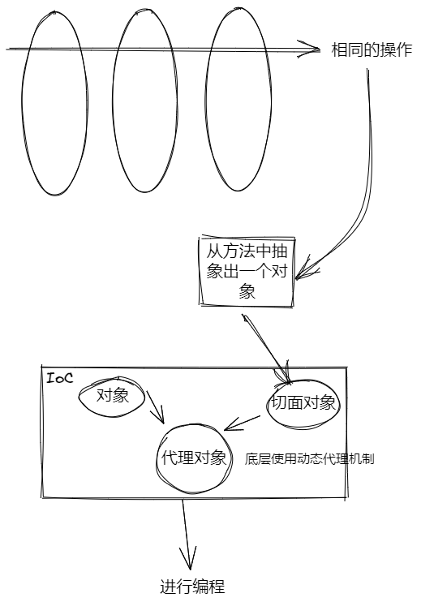
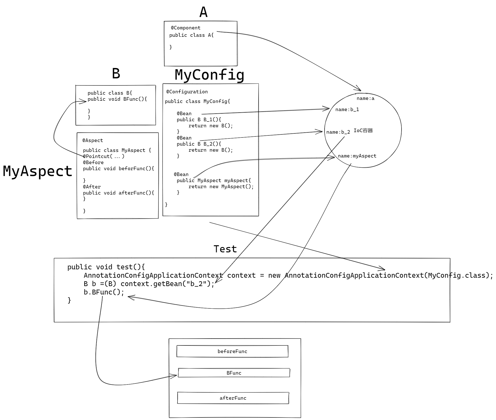

# IoC


## 什么是IoC

理解为一个容器。由Spring框架来运行和操作。对象的创建和管理交给IoC容器，使用者只需要在意如何调用即可。


## 如何使用IoC

pom.xml中需要依赖

```xml
<dependency>
    <groupId>org.springframework</groupId>
    <artifactId>spring-context</artifactId>
</dependency>
```


将要注入IoC的类注册为bean。

两种方式：

1. 通过xml文件配置(老方法，最好不用)
2. 通过注解。(推荐)

### 注册

对类进行注解或者在配置类中注解。

@Component 会直接创建一个bean注入IoC，默认名称是改为小写开头的类名。

@Bean 作用于一个方法上时，会将此方法的返回值注入IoC，默认名称是改为小开头的方法名。

伪代码如下

```java
public class Person{
  @Configuration    //配置类注解
  public static class PersonConfig{
    @Bean
    //@Qualifier("personOne") - doesn't work - bean qualifier is method name
    public Person personOne() {
        return new Person("Joe", "Smith");
    }

    @Bean
    //@Qualifier("personTwo") - doesn't work - bean qualifier is method name
    public Person personTwo(@Value("Alice") String lastName) {
        return new Person("Mary", lastName);
    }
  }
  /* blah blah */
}

@Component
public class SomePersonReference{
  @Autowired
  @Qualifier("personTwo")
  Person marry;
}
```

> 先看第一个注解@Configuration，说明这个类时是个配置类，里面时关于一个bean的配置。
>
> @Bean，注解下面的方法。将其返回值创建bean并注入到IoC当中。
>
> @Value，注解后面的String lastName。直接赋值为 lastName = “Alice”。
>
> 同时，@Value可以以读取外部文件内容来进行赋值。
>
> @Component，注解下方的类，将直接以somePersonReference的名称创建一个bean注入到IoC当中。
>
> @Autowired，注解下方的字段。Person marry将由Spring去IoC里去找一个Person类的bean直接赋值给marry，不需要手动赋值。尽量唯一。
>
> 如上面代码所示，有personOne,personTwo两个Person类型bean。不唯一的情况下@Autowired就不知道用哪个来赋值了。
>
> 于是需要@Qualifier(”personTwo")，当候选bean不唯一时，用过该注解来筛选。所示的例子通过bean的名称来筛选。将名为personTwo的bean自动注入到marry当中。


### 生成

正常情况在程序编译好后，就由Spring框架实例化所有bean对象并注入IoC中。

还有一种模式是在调用该bean对象时，才进行创建和实例化。

### 查找

一般情况使用

```java
AnnotationConfigApplicationContext context = new AnnotationConfigApplicationContext(MainConfigOfAOP.class);
MathCalculator mathCalculator = context.getBean(MathCalculator.class);
```

第一行括号内的参数通常为一个配置类。根据此配置类来创建一些bean，注入IoC中。可以通过context来查找。

第二行内的参数可以填写，需要查找的bean的名称，类型等。 根据括号内的条件来查找bean。

# AOP

## AOP概念

将一些函数的非核心业务代码抽离出来，例如：日志打印等。以便函数可以只关注自己的核心业务逻辑部分。

解耦合。



-----

还有一种理解，就是在函数运行的特殊时候，触发一些事件。

比如：在某些方法(可以自己选择，定义)运行前，运行后，成功执行后，抛出异常后，调用前后。五种情况下，触发一些其他事件。

详细的查看AOP.md。


## AOP实现流程

需要一些依赖

```xml
注解@Aspect需要
<dependency>
    <groupId>org.springframework</groupId>
    <artifactId>spring-aspects</artifactId>
</dependency>
启动Aspectj需要
<dependency>
     <groupId>org.aspectj</groupId>
     <artifactId>aspectjweaver</artifactId>
 </dependency>

```


1. 定义切面

2. 切入点表达式

3. 具体什么情况下触发什么事件

4. 注入IoC     [通过@Component或者配置类中@Bean]

   > 通过配置类使用时，需要对该配置类添加注解@EnableAspectJAutoProxy


伪代码

```java
@Aspect //声明是切面类
public class MyAspect{
    @Pointcut("execution(...)")  //...处填写需要触发事件的方法，由切入点表达式定义
    public void myPointCut(){} //myPointCut()就代表了上面切入点所代表的方法
    
    @Before("myPointCut")
    public beforeFunc(){      //在切入点表达式所代表的方法运行前，执行该方法。
        
    } 		
    
    @After("myPointCut")    //在切入点表达式所代表的方法运行后，执行该方法。
    public afterFunc(){}

}
```

但是某些时候，我希望在方法执行前，打印出方法的参数列表等信息。

由上可得，显然应该使用@Before注解，但是又如何获得方法的参数，名称等信息？于是需要JoinPoint。

| 方法           | 功能                                                         |
| -------------- | ------------------------------------------------------------ |
| getSignature() | 获取目标方法名，所属类的Class等信息                          |
| getArgs()      | 获取方法参数。可以通过Arrays.asList(jp.getArgs())。得到参数列表。 |
| getTarget()    | 获取被代理对象                                               |
| getThis()      | 获取代理对象                                                 |

```java
@Befor("myPointCut")
public beforeFunc(JoinPoint jp){
    print(jp.getSignature);
}
```


# IoC+AOP例子


POJO

```java
package com.example.ioc;

public class Tiger {
    public void eat(String food) {
        System.out.println("Tiger is eating "+food);
    }

    public void sleep() {
        System.out.println("Tiger is sleeping");
    }

    public void run() {
        System.out.println("Tiger is running");
    }
}
```

切面类

```java
package com.example.ioc;

import org.aspectj.lang.JoinPoint;
import org.aspectj.lang.annotation.After;
import org.aspectj.lang.annotation.Aspect;
import org.aspectj.lang.annotation.Before;
import org.aspectj.lang.annotation.Pointcut;

import java.util.Arrays;

@Aspect
public class AnimalAspect {
    @Pointcut("execution(* com.example.ioc.Tiger.*(..))")
    public void pointcut(){}

    @Before("pointcut()")
    public void beforeLog(JoinPoint jp){
        System.out.println("Animal want to do sth");
        System.out.println("1"+jp.getSignature());
        System.out.println("2"+ Arrays.asList(jp.getArgs()));
        System.out.println("3"+jp.getTarget());
        System.out.println("4"+jp.getThis());
    }

    @After("pointcut()")
    public void afterLog(){
        System.out.println("Animal have done sth");
    }
}
```


配置类

```java
package com.example.ioc;

import org.springframework.context.annotation.Bean;
import org.springframework.context.annotation.Configuration;
import org.springframework.context.annotation.EnableAspectJAutoProxy;

@Configuration
@EnableAspectJAutoProxy
public class AnimalConfig {
    @Bean
    public Lion lion(){
        return new Lion();
    }

    @Bean
    public Tiger tiger(){
        return new Tiger();
    }
    @Bean
    public AnimalAspect animalAspect(){
        return new AnimalAspect();
    }
}
```

测试方法

```java
public void test2(){
    AnnotationConfigApplicationContext context = new AnnotationConfigApplicationContext(AnimalConfig.class);
    Tiger tiger =(Tiger) context.getBean("tiger");
    System.out.println(tiger.getClass());
    tiger.eat("fish");
}
```

输出

```
class com.example.ioc.Tiger$$EnhancerBySpringCGLIB$$b319a46
Animal want to do sth
1void com.example.ioc.Tiger.eat(String)
2[fish]
3com.example.ioc.Tiger@630cb4a4
4com.example.ioc.Tiger@630cb4a4
Tiger is eating fish
Animal have done sth
```


