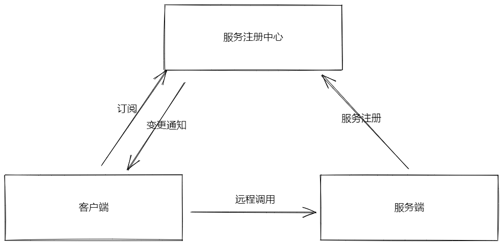

# Nacos是什么

阿里开源的服务管理平台。

用于动态服务发现、配置和管理。

服务注册中心和配置中心的组合体。

# 服务注册中心



- 服务注册中心：Nacos Server，可以为服务提供者和服务消费者提供服务注册和发现功能。
- 服务提供者：Nacos Client，用于对外服务。将自己提供的服务注册到注册中心。以供服务消费者发现和调用。
- 服务消费者：Nacos Client，用于消费服务。从服务注册中心获取服务列表，调用自己需要的服务。

# 使用

[Nacos：Spring Cloud Alibaba服务注册与配置中心（非常详细） (biancheng.net)](http://c.biancheng.net/springcloud/nacos.html)

按照上述网址进行。

# 服务发现

需要依赖

```xml
<dependency>
    <groupId>com.alibaba.cloud</groupId>
    <artifactId>spring-cloud-starter-alibaba-nacos-discovery</artifactId>
</dependency>
```

要先启动Nacos。能进入后台界面。

不在程序代码中体现，通过application.properties或application.yml配置文件设置。

需要在启动类上添加注解@EnableDiscoveryClient

nacos中的client通常指注册服务的一方，包括provider和consumer。

## Provider

```xml
server.port=8081
spring.application.name=nacos-provider
spring.cloud.nacos.discovery.server-addr=127.0.0.1:8848
management.endpoints.web.exposure.include=*
```

1. 通过8081对服务进行访问。

2. 在nacos后台显示的服务名。
3. 需要注册到的nacos的地址。
4. endpoints，用于环境隔离。

## Consumer

通过Provider的服务名进行调用。

```xml
server:
  port: 8801  #端口号
spring:
  application:
    name: spring-cloud-alibaba-consumer #自己的服务名
  cloud:
    nacos:
      discovery:
        server-addr: localhost:8848  #Nacos server 的地址
#以下配置信息并不是默认配置，而是我们自定义的配置，目的是不在 Controller 内硬编码服务提供者的服务名
service-url:
  nacos-user-service: http://spring-cloud-alibaba-provider #服务提供者的服务
```


```java
@RestController
@Slf4j
public class DeptController_Consumer {
    @Resource
    private RestTemplate restTemplate;
    @Value("${service-url.nacos-user-service}")
    private String serverURL; //服务提供者的服务名
    @GetMapping("/consumer/dept/nacos/{id}")
    public String paymentInfo(@PathVariable("id") Long id) {
        return restTemplate.getForObject(serverURL + "/dept/nacos/" + id, String.class);
    }
}
```

通过对 http://127.0.0.1:8801/consumer/dept/nacos/1 访问时，会返回 http://spring-cloud-alibaba-provider/dept/nacos/1 的内容。

即consumer对provider注册的服务进行了调用。

## 配置项信息

| 配置项              | Key                                              | 默认值                       | 说明                                                         |
| ------------------- | ------------------------------------------------ | ---------------------------- | ------------------------------------------------------------ |
| 服务端地址          | `spring.cloud.nacos.discovery.server-addr`       |                              | Nacos Server 启动监听的ip地址和端口                          |
| 服务名              | `spring.cloud.nacos.discovery.service`           | `${spring.application.name}` | 注册的服务名                                                 |
| 权重                | `spring.cloud.nacos.discovery.weight`            | `1`                          | 取值范围 1 到 100，数值越大，权重越大                        |
| 网卡名              | `spring.cloud.nacos.discovery.network-interface` |                              | 当IP未配置时，注册的IP为此网卡所对应的IP地址，如果此项也未配置，则默认取第一块网卡的地址 |
| 注册的IP地址        | `spring.cloud.nacos.discovery.ip`                |                              | 优先级最高                                                   |
| 注册的端口          | `spring.cloud.nacos.discovery.port`              | `-1`                         | 默认情况下不用配置，会自动探测                               |
| 命名空间            | `spring.cloud.nacos.discovery.namespace`         |                              | 常用场景之一是不同环境的注册的区分隔离，例如开发测试环境和生产环境的资源（如配置、服务）隔离等 |
| AccessKey           | `spring.cloud.nacos.discovery.access-key`        |                              | 当要上阿里云时，阿里云上面的一个云账号名                     |
| SecretKey           | `spring.cloud.nacos.discovery.secret-key`        |                              | 当要上阿里云时，阿里云上面的一个云账号密码                   |
| Metadata            | `spring.cloud.nacos.discovery.metadata`          |                              | 使用Map格式配置，用户可以根据自己的需要自定义一些和服务相关的元数据信息 |
| 日志文件名          | `spring.cloud.nacos.discovery.log-name`          |                              |                                                              |
| 集群                | `spring.cloud.nacos.discovery.cluster-name`      | `DEFAULT`                    | Nacos集群名称                                                |
| 接入点              | `spring.cloud.nacos.discovery.endpoint`          |                              | 地域的某个服务的入口域名，通过此域名可以动态地拿到服务端地址 |
| 是否集成Ribbon      | `ribbon.nacos.enabled`                           | `true`                       | 一般都设置成true即可                                         |
| 是否开启Nacos Watch | `spring.cloud.nacos.discovery.watch.enabled`     | `true`                       | 可以设置成false来关闭 watch                                  |

# 配置管理

[从nacos中读取自定义配置文件的两种方案 - 掘金 (juejin.cn)](https://juejin.cn/post/7045194238732009508)

需要依赖

```xml
<dependency>
    <groupId>com.alibaba.cloud</groupId>
    <artifactId>spring-cloud-starter-alibaba-nacos-config</artifactId>
</dependency>
```

在nacos后台配置。

使用DataId和GROUP来确定一个配置。

booststrap.yml文件配置

```yml
server:
  port: 3377 #端口号
spring:
  application:
    name: config-client #服务名
  profiles:
    active: dev #激活dev配置   去配置中心找config-client-dev.yml配置文件
  cloud:
    nacos:
      discovery:
        server-addr: 127.0.0.1:8848 #Nacos服务注册中心地址
      config:
        server-addr: 127.0.0.1:8848 #Nacos作为配置中心地址
        file-extension: yaml #指定yaml格式的配置
```

服务地址http://locaohost:3377

服务名：config-client，但是服务并不会注册到服务列表。

Data ID配置时要符合${ConfigName}(-${Profile}).${ExtensionFile}。

相当于告诉程序到配置中心地址去找哪个配置文件。

配置内容也在后台界面完成。


就可以在代码代码中直接调用配置内容。

示例：

```java
@RestController
@RefreshScope
public class ConfigClientController {
    @Value("${config.info}")
    private String ConfigInfo;
    @GetMapping("/config/info")
    public String getConfigInfo(){
        return ConfigInfo;
    }
}
```

# Namespace

用于区分隔离。

不同的namespace下，可以存在相同的Group和Data ID的配置。

常用场景：不同环境的配置的区分隔离。开发环境和测试环境下有着相同命名的Group和Data ID配置，就可以通过namespace进行区分。

设置，必须放在bootstrap下。

```xml
spring.cloud.nacos.config.namespace=b3404bc0-d7dc-4855-b519-570ed34b62d7
```

这一串数字是namespace对应的id。通过nacos的控制台获取。

# Group

默认使用DEFAULT_GROUP

也可以通过文件进行设置，放在bootstrap下。

```xml
spring.cloud.nacos.config.group=DEVELOP_GROUP
```

# Endpoint

客户端需要一种能力能够及时感知到集群发生变化。通过endpoint来实现。

默认空<系统变量ALIBABA_ALIWARE_ENDPOINT_URL<配置文件


Spring Boot中有两种上下文配置，一种是bootstrap，另外一种是application。bootstrap是应用程序的父上下文，也就是说bootstrap加载优先于application。由于在加载远程配置之前，需要读取Nacos配置中心的服务地址信息，所以Nacos服务地址等属性配置需要放在bootstrap中。

使用bootstrap需要引入相关依赖。


如何去Nacos读取配置？

配置在Nacos中通过Data-ID进行区分。

Data-ID的默认规则是\${prefix}-\${spring.profile.active}.\${file-extension}

+ 默认：没有指定前缀prefix的情况下，去Nacos上加载Data-ID为\${spring.applicaton.name}-\${file-extension:properties}文件扩展默认是properties。
+ 若指定了prefix属性，则会加载Data ID = name的配置。
+ spring.profile.active表示多环境支持。
