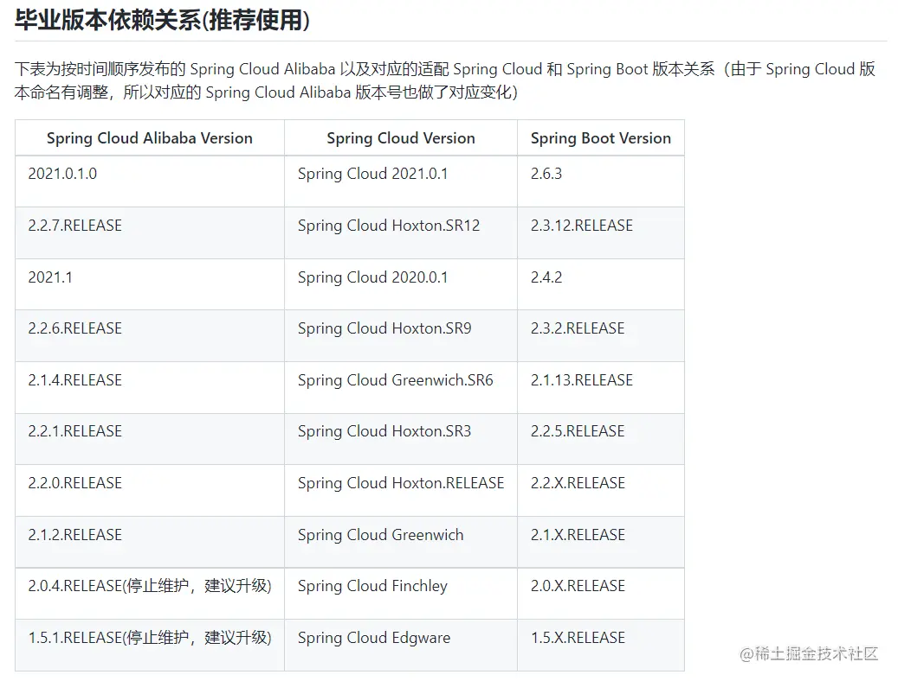
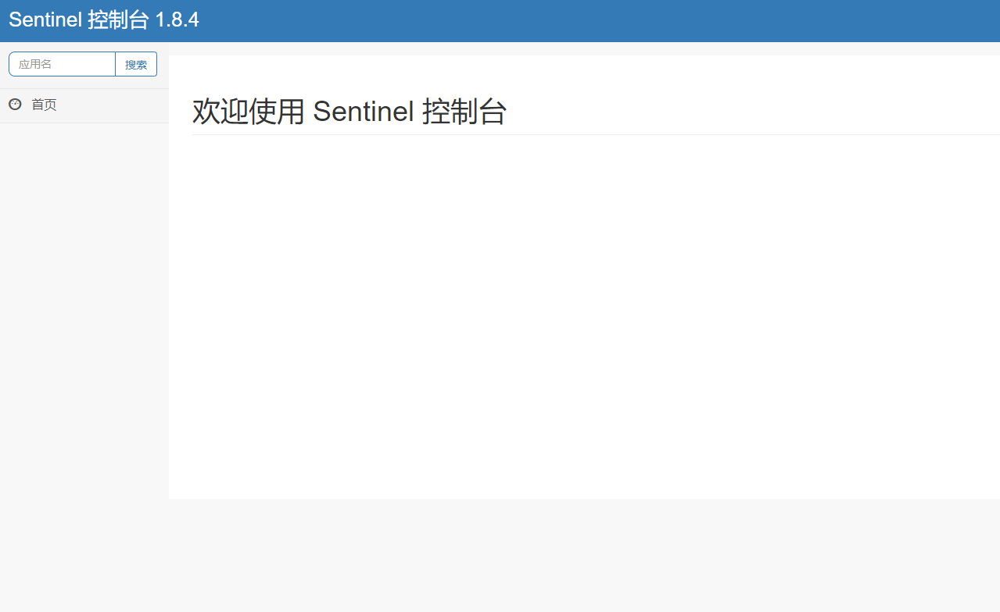

# Sentinel

以流量为切入点，从流量控制、熔断降级、系统负载保护等多个维度保护服务的稳定性。

# 如何使用

## 客户端，类似于nacos的后台界面

下载sentinel-dashboard.jar

使用cmd，切勿使用powershell。

```cmd
java -Dserver.port=8333 -Dcsp.sentinel.dashboard.server=localhost:8333 -Dproject.name=sentinel-dashboard -jar sentinel-dashboard-1.4.2.jar
```

端口号，路径，版本更换成自己的。

## 客户端接入，项目接入控制台

```yml
spring:
  cloud:
    sentinel:
      transport:
        port: 8719
        dashboard: localhost:8080
```


添加所需的依赖

```xml
<dependency>
    <groupId>com.alibaba.cloud</groupId>
    <artifactId>spring-cloud-starter-alibaba-sentinel</artifactId>
    <version>2021.1</version>
</dependency>
```

注意依赖版本和spring boot版本尽量对应，否则会发生循环依赖的错误。



若您是通过 [Spring Cloud Alibaba](https://github.com/alibaba/spring-cloud-alibaba/wiki/Sentinel) 接入的 Sentinel，则无需额外进行配置即可使用 `@SentinelResource` 注解。

若您的应用使用了 Spring AOP（无论是 Spring Boot 还是传统 Spring 应用），您需要通过配置的方式将 `SentinelResourceAspect` 注册为一个 Spring Bean：

```
@Configuration
public class SentinelAspectConfiguration {

    @Bean
    public SentinelResourceAspect sentinelResourceAspect() {
        return new SentinelResourceAspect();
    }
}
```


# sentinel 遇到的问题



左侧空白，只有首页。


```cmd
java -Dserver.port=8333 -Dcsp.sentinel.dashboard.server=localhost:8333 -Dproject.name=sentinel-dashboard   -jar --add-exports=java.base/sun.net.util=ALL-UNNAMED sentinel-dashboard-1.8.4.jar
```

要多加一行参数，Java 16 后默认不允许对 JDK 的内部模块进行反射。

jdk17已经修复了，只有18不行....

多加一行觉得启动麻烦的就换一下jdk版本。