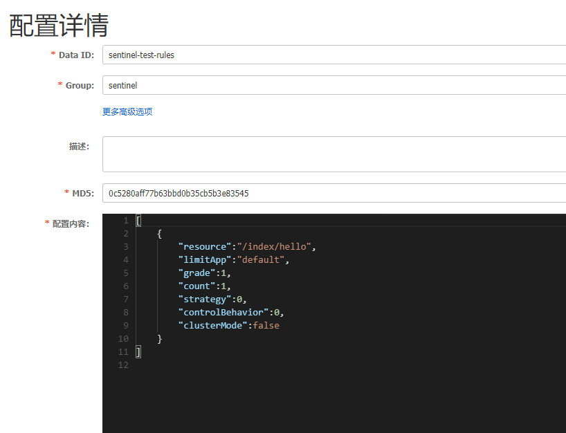
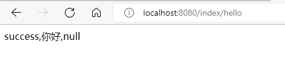
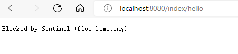
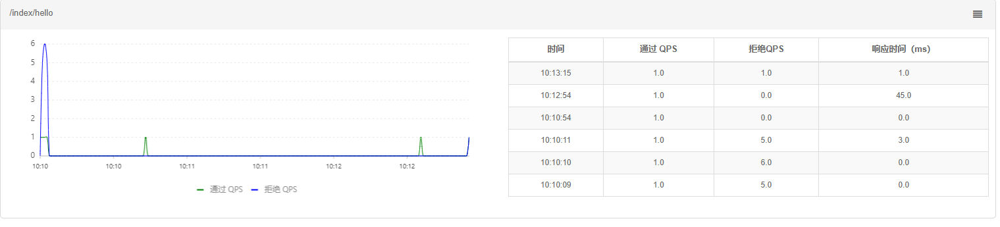

# Sentinel

以流量为切入点，从流量控制、熔断降级、系统负载保护等多个维度保护服务的稳定性。

# 如何使用

## 客户端，类似于nacos的后台界面

下载sentinel-dashboard.jar

使用cmd，切勿使用powershell。

```cmd
java -Dserver.port=8333 -Dcsp.sentinel.dashboard.server=localhost:8333 -Dproject.name=sentinel-dashboard -jar sentinel-dashboard-1.4.2.jar
```

端口号，路径，版本更换成自己的。

## 客户端接入，项目接入控制台

```yml
spring:
  cloud:
    sentinel:
      transport:
        port: 8719
        dashboard: localhost:8080
```


添加所需的依赖

```xml
<dependency>
    <groupId>com.alibaba.cloud</groupId>
    <artifactId>spring-cloud-starter-alibaba-sentinel</artifactId>
    <version>2021.1</version>
</dependency>
```

注意依赖版本和spring boot版本尽量对应，否则会发生循环依赖的错误。


若您是通过 [Spring Cloud Alibaba](https://github.com/alibaba/spring-cloud-alibaba/wiki/Sentinel) 接入的 Sentinel，则无需额外进行配置即可使用 `@SentinelResource` 注解。

若您的应用使用了 Spring AOP（无论是 Spring Boot 还是传统 Spring 应用），您需要通过配置的方式将 `SentinelResourceAspect` 注册为一个 Spring Bean：

```
@Configuration
public class SentinelAspectConfiguration {

    @Bean
    public SentinelResourceAspect sentinelResourceAspect() {
        return new SentinelResourceAspect();
    }
}
```


# sentinel 遇到的问题


左侧空白，只有首页。


```cmd
java -Dserver.port=8333 -Dcsp.sentinel.dashboard.server=localhost:8333 -Dproject.name=sentinel-dashboard   -jar --add-exports=java.base/sun.net.util=ALL-UNNAMED sentinel-dashboard-1.8.4.jar
```

要多加一行参数，Java 16 后默认不允许对 JDK 的内部模块进行反射。

jdk17已经修复了，只有18不行....

多加一行觉得启动麻烦的就换一下jdk版本。


# 实现限流

结合nacos

1. 启动nacos
2. 运行程序
3. 启动sentinel

-----

在nacos中配置流控规则



resource: 资源名称
limitApp: 来源应用
grade:阈值类型，0表示线程数，1表示QPS；
count：单机阈值；
strategy: 流控模式，0表示直接，1表示关联，2表示链路
controlBehavior:流控效果，0表示快速失败，1表示Warm Up,2表示排队等待；
clusterMode:是否集群


限制/index/hello资源，每秒访问超过一次就失败。

-----

程序内容

添加相关依赖

```xml
<dependency>
    <groupId>com.alibaba.cloud</groupId>
    <artifactId>spring-cloud-starter-alibaba-sentinel</artifactId>
    <version>2021.1</version>
</dependency>
<dependency>
    <groupId>com.alibaba.csp</groupId>
    <artifactId>sentinel-datasource-nacos</artifactId>
    <version>1.8.0</version>
</dependency>
<dependency>
    <groupId>com.alibaba.csp</groupId>
    <artifactId>sentinel-transport-simple-http</artifactId>
    <version>1.7.2</version>
</dependency>
<dependency>
    <groupId>com.alibaba.cloud</groupId>
    <artifactId>spring-cloud-starter-alibaba-sentinel</artifactId>
    <version>2021.1</version>
</dependency>
```

在主启动类上启动@EnableDiscoveryClient

添加IndexAction类，代码如下

```java
@RestController
@RequestMapping("/index")
public class IndexAction {
    protected static final Logger log = LoggerFactory.getLogger(IndexAction.class);

    @RequestMapping("/hello")
    @SentinelResource(value = "hello", fallback = "helloError")
    public String sentinelTest(String name) {
        log.debug("success,你好!!!," + name);
        return "success,你好," + name;
    }

    @RequestMapping("/test")
    public String sentinelTest2() {
        log.info("success,你好!!! test");
        return "success,你好!!! test";
    }

    public String helloError(String name, Throwable e) {
        log.error("限流控制,name:{}",name, e.getMessage());
        return "error," + name;
    }
}
```

由于对/index/hello进行了流控，当每秒访问超过一次时，就会触发fallback。

而/index/test则没有限制。

正常访问



次数过多时



可以通过sentinel控制台看到



通过的QPS只有1，当次数超过的时候，会被拒绝。


- fallback：若本接口出现未知异常，则调用fallback指定的接口。
- blockHandler：若本次访问被限流或服务降级，则调用blockHandler指定的接口。

# 熔断降级

## 什么是熔断降级

服务降级的使用场景有以下 2 种：

- 在服务器压力剧增时，根据实际业务情况及流量，对一些不重要、不紧急的服务进行有策略地不处理或简单处理，从而释放服务器资源以保证核心服务正常运作。
- 当某些服务不可用时，为了避免长时间等待造成服务卡顿或雪崩效应，而主动执行备用的降级逻辑立刻返回一个友好的提示，以保障主体业务不受影响。

