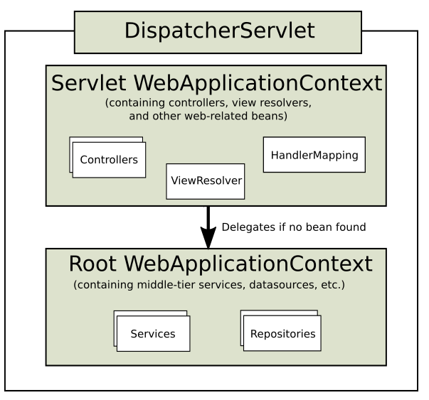

# Spring MVC是什么

一种web开发框架。

Model(数据模型层)，View(视图层)，Controller(控制层)。使用MVC的目的是将M和V的实现代码分离，使同一个程序可以有不同的表现形式。View的定义比较清晰，就是用户界面。

- View：负责格式化数据并把它们呈现给用户，包括数据展示、用户交互、数据验证、页面设计等功能。
- Controller：负责接收并转发请求，对请求进行处理后，指定试图并将响应结果发送给客户端。
- Model：应用程序的主体部分。负责数据逻辑(业务规则)的处理和实现数据操作(在数据库中存储数据)。主要指工程中的JavaBean。
    - 实体类Bean：专门存储业务数据
    - 业务处理Bean：指Servlet或Dao对象，专门用于处理业务逻辑。


工作流程：用户通过视图层发送请求到服务器，在服务器中请求被Controller接收，Controller调用相应的Model层处理请求，将结果返回。Controller再根据处理结果找到相应的View视图，渲染数据后响应给浏览器。

Spring MVC是Spring为表述层(表示层)开发的。

> 三层架构为：表述层、业务逻辑层、数据访问层。表述层展示前台页面和后台servlet。


> Java Servlet 是运行在 Web 服务器或应用服务器上的程序，它是作为来自 Web 浏览器或其他 HTTP 客户端的请求和 HTTP 服务器上的数据库或应用程序之间的中间层。
>
> 使用 Servlet，您可以收集来自网页表单的用户输入，呈现来自数据库或者其他源的记录，还可以动态创建网页。


# 框架流程


- DispatcherServlet

  前端控制器。所有的请求都要经过DispatcherServlet来统一分发。相当于转发器或中央处理器。

- HandlerMapping

  处理映射器。根据请求的URL路径，通过注解或XML配置，寻找匹配的处理器(Handler)信息。

- HandlerAdapter

  处理器适配器。根据映射器找到的处理器信息，按照特定规则执行相关的处理器。

- Handler

  处理器。和Java Servlet角色一致。执行相关的请求处理逻辑，返回相应的数据和视图信息，封装在ModelAndView中。

- View Resolver

  视图解析器。通过MAV对象中的View信息将逻辑视图名解析成真正的视图View。

- View

  视图。本身就是一个接口，实现支持不同的View类型。

# DispatcherServlet


DispatcherServlet创建的上下文用于装载web功能相关的bean，例如Controller、ViewResolver等。

利用java配置而不用web.xml。Servlet3.0后，逐渐不使用web.xml。

配置Servlet例子，通过实现接口来配置。

``` java
public class MyWebApplicationInitializer implements WebApplicationInitializer {

    @Override
    public void onStartup(ServletContext servletContext) {

        // Load Spring web application configuration
        AnnotationConfigWebApplicationContext context = new AnnotationConfigWebApplicationContext();
        context.register(AppConfig.class);

        // Create and register the DispatcherServlet
        DispatcherServlet servlet = new DispatcherServlet(context);
        ServletRegistration.Dynamic registration = servletContext.addServlet("app", servlet);
        registration.setLoadOnStartup(1);
        registration.addMapping("/app/*");
    }
}
```

DispatcherServlet上下文层次结构。

包含一个根上下文和若干个DispatcherServlet实例。根上下文可以被DS实例共享。



配置例子（设定根和其他实例的区别）：

```java
public class MyWebAppInitializer extends AbstractAnnotationConfigDispatcherServletInitializer {

    @Override
    protected Class<?>[] getRootConfigClasses() {  //根上下文
        return new Class<?>[] { RootConfig.class };
    }

    @Override
    protected Class<?>[] getServletConfigClasses() { //非根上下文
        return new Class<?>[] { App1Config.class };
    }

    @Override
    protected String[] getServletMappings() {   //路径匹配
        return new String[] { "/app1/*" };
    }
}
```


# HandlerMapping

所有HandlerMapping都支持处理程序拦截器(HandlerInterceptor)。

有三种方法可以调用:

```java
preHandler(..)://在执行处理程序前
postHandle(..)://执行处理程序后
afterCompletion(..)://完成完整的请求后
```


# 过滤器

用于过滤包括请求和响应。


## Spring 内置 Filter

- CharacterEncodingFilter：对请求体，响应体字符集处理的过滤器。统一字符编码，避免出现乱码现象。

- CorsFilter：处理跨域的过滤器。根据配置添加跨域相关的请求头。

- FormContentFilter：对于请求方法为PUT、PATCH、DELETE，内容类型为表单的请求。

  > 因为Servlet API仅能对HTTP POST支持表单字段访问。使用上述可以增加请求的类型支持。


# 创建控制器

## @Controller

声明某类的实例是一个控制器。

## @RequestMapping

基于注解的控制器类上，使用@RequestMapping注解将请求与处理方法相对应。

``` java
package net.biancheng.controller;

import org.springframework.stereotype.Controller;
import org.springframework.web.bind.annotation.RequestMapping;
@Controller
@RequestMapping("/index")
public class IndexController {
    @RequestMapping("/login")
    public String login() {
        return "login";
    }

    @RequestMapping("/register")
    public String register() {
        return "register";
    }
}
```

| 属性      | 作用                                             |
| --------- | ------------------------------------------------ |
| value     | 默认属性，指定路径                               |
| path      | 类似value                                        |
| name      | 相当于方法的注释                                 |
| method    | 支持哪些HTTP请求。默认下是支持全部。(get,post等) |
| params    | 指定请求中的参数，参数符合要求才能正常访问方法   |
| header    | 请求中必须包含某些指定的请求头才能正常访问       |
| consumers | 指定处理请求的提交内容类型                       |
| produces  | 指定返回的内容类型和编码                         |

可以使用快捷方法，@GetMapping，@PostMapping，@PutMapping，@DeleteMapping，@PatchMapping。

默认情况下，大多数控制器方法应该使用快捷方法，而不是@RequestMapping。

# 传参


## PathVariable

用于匹配路径中的参数，传入方法。

```java 
@Controller
@RequestMapping("hello")
public class HelloController2 {
    @RequestMapping("show5/{id}/{name}")
    public ModelAndView test5(@PathVariable("id") Long ids ,@PathVariable("name") String names){
        ModelAndView mv = new ModelAndView();
        mv.addObject("msg","占位符映射：id:"+ids+";name:"+names);
        mv.setViewName("hello2");
        return mv;
    }
```

请求路径为 http://localhost:8080/hello/show5/1/james 时，传入的参数id = "1"，name = "james"。

## @ResponseBody

作用于方法上，方法的返回值会直接写入HTTP response body中，一般在异步获取数据时使用，也就是AJAX。

## @RequestBody

从请求正文中接收参数。

@RequestParam 从请求头中接收参数。适用于get和post。

