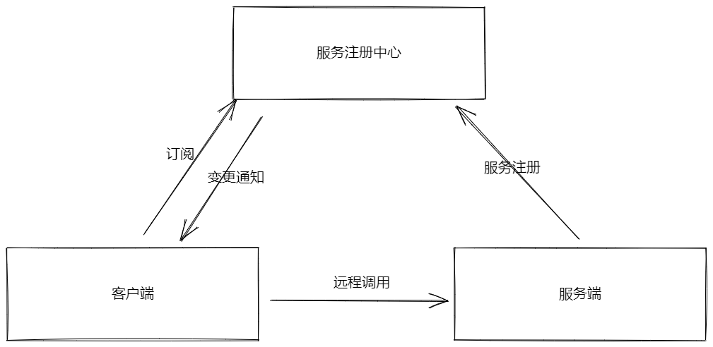

# 什么是微服务

单一应用程序构成的小服务。服务可以用不同的编程语言与数据库等组件实现。

鉴于「单体应用程序」有的缺点，单个应用程序被划分成各种小的、互相连接的微服务，一个微服务完成一个比较单一的功能，相互之间保持独立和解耦合，这就是微服务架构。

# 服务注册与发现

服务与服务之间的通信方式：HTTP通信，消息通信(第三方消息代理)，事件驱动通信。

微服务直接需要互相调用才能完成整体功能。服务发现就是在众多微服务中找到正确的目标服务地址。通常使用服务注册中心。也就是第二种通信方式。

# 服务监控

监控服务的内存使用、调用次数、健康状况等信息。

# 服务容错

[熔断、隔离、限流和降级、超时机制]等[服务容错]机制来保证服务持续可用性。

# 服务安全

对敏感服务采用安全鉴权机制，对服务的访问需要进行相应的身份验证和授权。

# 服务治理

解决上面微服务架构缺陷，[服务治理]就出现了。

# 一些成熟的微服务框架

