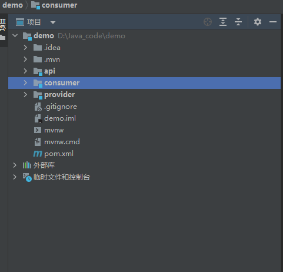
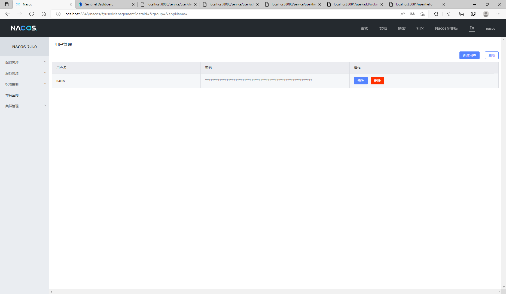
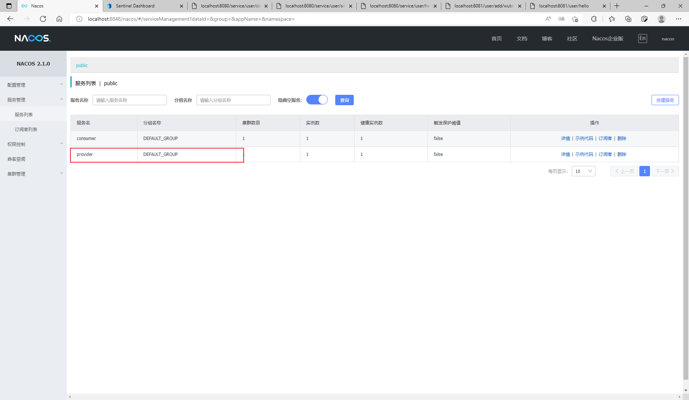
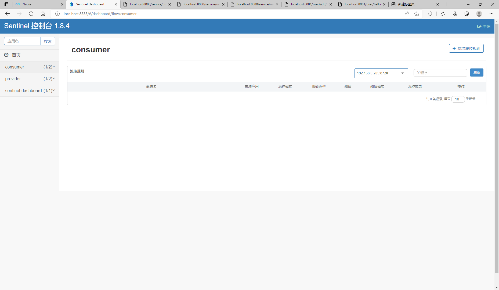
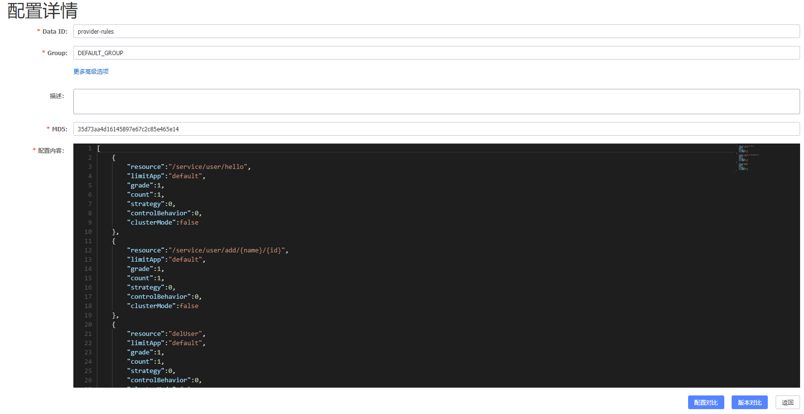
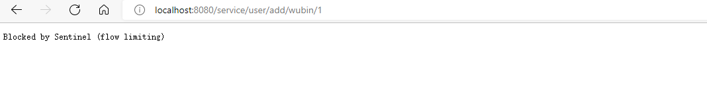
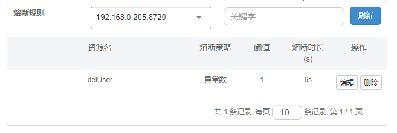
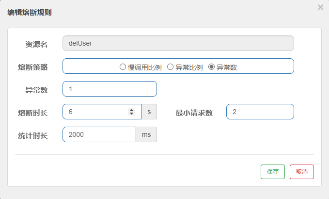

# 工程创建

## 父工程



demo作为一个父工程，并不直接实现程序功能。而是对各模块共有的依赖进行管理，尤其是版本。

试想，每个模块之间的依赖不免有相同的部分，每次都导入在各自的pom.xml中显得极为繁琐。故可以放在父工程的pom.xml里面。

相对于其他模块下的pom来说，父工程需要有

```xml
<packaging>pom</packaging>
```

`<parent>`标签表示，以哪个依赖为父模板创建，包含它所有的依赖。创建项目时，会自动以spring-boot-starter-parent会模板。

```xml
   <parent>
        <groupId>org.springframework.boot</groupId>
        <artifactId>spring-boot-starter-parent</artifactId>
        <version>2.4.2</version>
        <relativePath/> <!-- lookup parent from repository -->
    </parent>
```

自动创建时用的版本一般为最新版，对一些未及时更新的依赖兼容较差，建议使用稍微以前的版本。具体版本和依赖版本兼容的对应版本可以通过搜索查表。

`<properties>`顾名思义，属性的意思。可以放一些常量。基本是版本号信息。

试想一下，需要管理的依赖很多的时候，需要修改版本就很麻烦，要查找。通过`<properties>`集中在一起，在需要修改时会显得极为方便。

```xml
<properties>
    <java.version>17</java.version>
    <com-alibaba-cloud.version>2021.1</com-alibaba-cloud.version>
    <org-springframework-cloud.version>2020.0.4</org-springframework-cloud.version>
</properties>
```

同时可以用，`<dependencyManagement>`标签对某系列依赖进行版本指定。

```xml
   <dependencyManagement>
        <dependencies>
            <dependency>
                <groupId>com.alibaba.cloud</groupId>
                <artifactId>spring-cloud-alibaba-dependencies</artifactId>
                <version>2021.1</version>
                <type>pom</type>
                <scope>import</scope>
            </dependency>
            <dependency>
                <groupId>org.springframework.cloud</groupId>
                <artifactId>spring-cloud-dependencies</artifactId>
                <version>2020.0.4</version>
                <type>pom</type>
                <scope>import</scope>
            </dependency>
        </dependencies>
    </dependencyManagement>
```

正常导入依赖时需要指定版本

```xml
<dependency>
    <groupId>com.alibaba.csp</groupId>
    <artifactId>sentinel-datasource-nacos</artifactId>
    <version>1.8.4</version>
</dependency>
```

但如果是被<dependencMangement>所管理的group下的模块，则导入时可以不指定版本。因为在上面已被统一指定了。

```xml
<dependency>
    <groupId>com.alibaba.cloud</groupId>
    <artifactId>spring-cloud-starter-alibaba-sentinel</artifactId>
</dependency>
```

可以极大的省去某些版本不对应所产生的错误。

## 模块创建

api，consumer，provider三个模块的创建

在demo上右击->新建->模块即可。

模块下的pom.xml中的`<parent>`标签下模块换成demo，在demo下导入的共有的依赖，就不需要各自都导入一遍。

模块下含有src，resources文件。

src：程序源码。

resouces：资源文件，包括但不限于静态页面，配置文件等。

# RESTful服务

需要相关web依赖。

在provider模块内主启动类，同级目录下，创建UserServiceImpl.java文件用于写简单的服务。

```java
@RestController
@RequestMapping("/service/user")
public class UserServiceImpl {


    @RequestMapping("/hello")
    public String hello(){
        return "hello test";
    }
}
```

启动服务，就可以通过spring的默认端口8080进行访问。

http://localhost:8080/service/user/hello


# Nacos

## 注册中心

需要依赖

```xml
<dependency>
    <groupId>com.alibaba.cloud</groupId>
    <artifactId>spring-cloud-starter-alibaba-nacos-discovery</artifactId>
</dependency>
```

下载Nacos，并启动。在bin目录下运行以下命令。

可以通过默认端口8848进入Nacos界面。

http://localhost:8848/nacos/index.html

```shell
.\startup.cmd -m standalone
```



通过对模块内的resouce里的配置文件进行配置，就可以把服务注册到Nacos上。

```yml
# 指定端口号，默认的就是8080，不同的模块需要用不同的端口号
server:
  port: 8080

spring:
  application:
    name: provider # 在Nacos上显示的name
  cloud:
    nacos:
      discovery:
        server-addr: localhost:8848 # Nacos地址：端口号
management:
  endpoints:
    web:
      exposure:
        include: "*" # 暴露的服务
```

再进入Nacos时就可以到provider了。



这里还注册了consumer模块。

为什么需要注册到Nacos呢？

当consumer模块内需要对provider内的接口进行调用时。

provider模块内：

```java
@RestController
@RequestMapping("/service/user")
public class UserServiceImpl {
    @RequestMapping("/add/{name}/{id}")
    public String addUser(@PathVariable String name, @PathVariable int id){
        User user = new User();
        user.setName(name);
        user.setId(id);
        return "Using Service to add new User successful! Welcome "+ user.getName() +",your id is "+user.getId();
    }
}
```

consumer模块内：

```java
@RestController
@RequestMapping("/user")
public class UserController {

    @Resource
    private RestTemplate restTemplate;
    private String url = "http://localhost:8080";
    @RequestMapping("/add/{name}/{id}")
    public String addUser(@PathVariable String name, @PathVariable int id){
        return restTemplate.getForObject(url+"/service/user/add/"+name+"/"+id,String.class);
    }    
}
```

需要在provider模块的地址+端口，进行url拼接。当服务数量多了之后，就很难记住端口号了。当注册到服务中心之后，就可以通过注册的名字进行调用。

`private String url = "http://provider"`即可调用。

Nacos除了提供服务注册和发现之外，还具有配置中心的作用。

## 配置中心

需要依赖

```xml
<dependency>
    <groupId>com.alibaba.cloud</groupId>
    <artifactId>spring-cloud-starter-alibaba-nacos-config</artifactId>
</dependency>
```

并在配置文件进行配置

```yml
server:
  port: 8080 #端口号
spring:
  application:
    name: config-client #服务名
  profiles:
    active: dev #激活dev配置
  cloud:
    nacos:
      discovery:
        server-addr: 127.0.0.1:8848 #Nacos服务注册中心地址
      config:
        server-addr: 127.0.0.1:8848 #Nacos作为配置中心地址
        file-extension: yaml #指定yaml格式的配置
```

多了一个配置中心地址。就可以像引用本地配置文件一样，引用在Nacos上的配置文件。

# Sentinel 监控

直观的看到各接口的调用，流量等情况。

下载sentinel-dashboard.jar。

jdk17之前

```shell
java -Dserver.port=8333 -Dcsp.sentinel.dashboard.server=localhost:8333 -Dproject.name=sentinel-dashboard -jar sentinel-dashboard-1.8.4.jar
```


jdk17之后

```shell
java -Dserver.port=8333 -Dcsp.sentinel.dashboard.server=localhost:8333 -Dproject.name=sentinel-dashboard   -jar --add-exports=java.base/sun.net.util=ALL-UNNAMED sentinel-dashboard-1.8.4.jar
```

可以自己指定另外的端口号，把jar路径和名称换成自己的。

需要依赖

```xml
<dependency>
    <groupId>com.alibaba.cloud</groupId>
    <artifactId>spring-cloud-starter-alibaba-sentinel</artifactId>
</dependency>
<dependency>
      <groupId>com.alibaba.csp</groupId>
      <artifactId>sentinel-datasource-nacos</artifactId>
      <version>1.8.4</version>
</dependency>
<dependency>
     <groupId>com.alibaba.csp</groupId>
     <artifactId>sentinel-transport-simple-http</artifactId>
     <version>1.8.0</version>
</dependency>
```

通过http://localhost:8333进行访问



可以通过[簇点链路]进行流控规则设置，但是服务重新启动时，将会被清空，无法保存。

## 流控规则持久化配置

结合Nacos作为配置中心，从Nacos读取流控规则配置，达到每次重启服务但是流控规则依然奏效的目的。

在Nacos配置流控规则



resource：可以指定访问路径或通过@SentinelResource(value = " ")指定名称来选择。

程序配置文件

```yml
spring:
  application:
    name: provider
  cloud:
    nacos:
      discovery:
        server-addr: localhost:8848
    sentinel:
      transport:
        dashboard: localhost:8333
      datasource:
        ds:
          nacos:
            server-addr: localhost:8848
            data-id: provider-rules
            group-id: DEFAULT_GROUP
            rule-type: flow
            data-type: json
```


上例在每秒访问超过一次时，就会限流，返回错误信息。



默认限流提示信息。

可以通过@SentinelResource(blockHandler="funcName")来自定义限流提示信息。

自定义限流提示函数需要有于原来相同的返回值和参数，并多一个BlockException参数。

```java
@RequestMapping("/del/{name}")
@SentinelResource(value = "delUser",blockHandler = "delUserHandler")
public String delUser(@PathVariable String name){
    return "user "+name+" is delete";
}

public String delUserHandler(String name, BlockException e){
    return "系统繁忙，请稍后再试";
}
```


# Openfeign的使用

主要用服务调用的功能。

在上面的例子中，使用了Nacos后不需要记住端口号了，但是调用服务仍需要自己拼接url，也还是很麻烦。通过Openfeign组件，将拼接的步骤省去，使代码变得更为简洁。

需要依赖

```xml
<dependency>
    <groupId>org.springframework.cloud</groupId>
    <artifactId>spring-cloud-starter-openfeign</artifactId>
    <version>3.1.3</version>
</dependency>
<dependency>
     <groupId>org.springframework.cloud</groupId>
     <artifactId>spring-cloud-starter-loadbalancer</artifactId>
</dependency>
```

在需要调用服务的模块内，创建一个接口。

```java
@Component
@FeignClient("provider")
public interface UserFeign {
    @RequestMapping("/service/user/hello")
    String hello();
}
```

接着就可以很方便的调用provider里面的服务了。

```java
@RestController
@RequestMapping("/user")
public class UserController {

	@Resource
	private UserFeign userFeign;
	@RequestMapping("/hello")
	public String testHello(){
    	return userFeign.hello();
	}
}
```

就像调用方法一样，不再需要拼接url了。


# 熔断

不需要什么额外配置，通过sentinel设置熔断规则即可。


**慢调用比例** (`SLOW_REQUEST_RATIO`)：选择以慢调用比例作为阈值，需要设置允许的慢调用 RT（即最大的响应时间），请求的响应时间大于该值则统计为慢调用。当单位统计时长（`statIntervalMs`）内请求数目大于设置的最小请求数目，并且慢调用的比例大于阈值，则接下来的熔断时长内请求会自动被熔断。经过熔断时长后熔断器会进入探测恢复状态（HALF-OPEN 状态），若接下来的一个请求响应时间小于设置的慢调用 RT 则结束熔断，若大于设置的慢调用 RT 则会再次被熔断。

**异常比例** (`ERROR_RATIO`)：当单位统计时长（`statIntervalMs`）内请求数目大于设置的最小请求数目，并且异常的比例大于阈值，则接下来的熔断时长内请求会自动被熔断。经过熔断时长后熔断器会进入探测恢复状态（HALF-OPEN 状态），若接下来的一个请求成功完成（没有错误）则结束熔断，否则会再次被熔断。异常比率的阈值范围是 `[0.0, 1.0]`，代表 0% - 100%。

**异常数** (`ERROR_COUNT`)：当单位统计时长内的异常数目超过阈值之后会自动进行熔断。经过熔断时长后熔断器会进入探测恢复状态（HALF-OPEN 状态），若接下来的一个请求成功完成（没有错误）则结束熔断，否则会再次被熔断。


检测到java里的异常时，由fallback处理，当异常超出熔断规则时，就触发熔断，由blockHandler接管。超过熔断时间后，若下一次请求正常则从熔断状态变回正常，否则继续熔断。


同限流一样，也可以通过Nacos配置来达到将熔断规则持久化的目的。而不是每次开启服务都需要重新设置一次。

## 熔断规则持久化配置

在Nacos创建配置文件，通过程序的配置文件去读取即可。

熔断规则


```json
[
    {
        "resource":"delUser",		//资源名或路径
        "grade":2,					//熔断策略。0:慢调用比例,1:异常比例,2:异常数
        "count":1,					//慢调用比例模式下为慢调用临界 RT（超出该值计为慢调用）；异常比例/异常数模式下为对应的阈值。
        "timeWindow":6,				//熔断时长，单位为 s，默认5s
        "minRequestAmount":2,		//熔断触发的最小请求数，请求数小于该值时即使异常比率超出阈值也不会熔断
        "statIntervalMs":2000		//统计时长（单位为 ms），如 60*1000 代表分钟级，默认1000ms
        slowRatioThreshold:    		//慢调用比例阈值，仅慢调用比例模式有效（1.8.0 引入） 
    }
]
```

通过模块的配置文件来读取熔断规则

```yml
spring:
  application:
    name: provider
  cloud:
    nacos:
      discovery:
        server-addr: localhost:8848
    sentinel:
      transport:
        dashboard: localhost:8333
      datasource:
        ds:
          nacos:
            server-addr: localhost:8848
            data-id: provider-rules
            group-id: DEFAULT_GROUP
            # 流控规则
            rule-type: flow
            data-type: json
        ds2:
          nacos:
            server-addr: localhost:8848
            data-id: provider-fusing-rules
            group-id: DEFAULT_GROUP
            # 熔断规则
            rule-type: degrade
            data-type: json
```

然后就可以通过sentinel看到配置好的熔断规则了





# Dubbo

## 服务发现

```properties
# application.properties
dubbo
 registry
  address: zookeeper://127.0.0.1:2181
```

## RPC通信协议

Remote Procedure Call 远程过程调用协议

通过网络从远程计算机上请求服务。想调用本地方法一样调用远程的过程。

## 错误处理

 Unable to make protected final java.lang.Class java.lang.ClassLoader

添加启动参数

--add-opens java.base/java.lang=ALL-UNNAMED

jdk太新的缘故。
