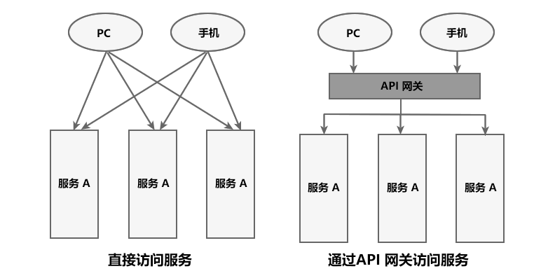
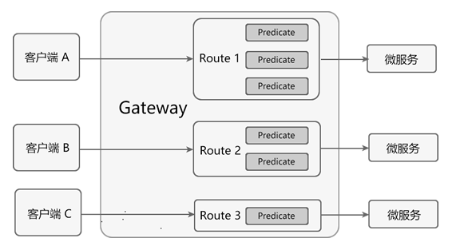

API网关的作用



使用spring cloud gateway作为网关实现方案。

# Spring Cloud Gateway

## 核心概念

最主要的功能就是路由转发，而在定义转发规则时主要涉及了以下三个核心概念。

| 核心概念          | 描述                                                         |
| ----------------- | ------------------------------------------------------------ |
| Route（路由）     | 网关最基本的模块。它由一个 ID、一个目标 URI、一组断言（Predicate）和一组过滤器（Filter）组成。 |
| Predicate（断言） | 路由转发的判断条件，我们可以通过 Predicate 对 HTTP 请求进行匹配，例如请求方式、请求路径、请求头、参数等，如果请求与断言匹配成功，则将请求转发到相应的服务。 |
| Filter（过滤器）  | 过滤器，我们可以使用它对请求进行拦截和修改，还可以使用它对上文的响应进行再处理。 |

在程序配置文件中配置

```yml
spring:
  cloud:
    gateway:                     # 网关模块
      routes:                    # 路由配置
        - id: xxx                # 路由id，唯一
          uri:xxx                # 满足条件后要转发到的目标地址
          predicates:            # 断言，需要满足的条件
            - Path=xxx
          filters:               # 过滤器，进行拦截，并实现一些非业务功能
                                 # 校验，日志输出，流量监控等
            - AddRequestParameter = xxxx
```


## Spring Cloud Gateway 工作流程  

1.  客户端将请求发送到 Spring Cloud Gateway 上。
2.  Spring Cloud Gateway 通过 Gateway Handler Mapping 找到与请求相匹配的路由，将其发送给 Gateway Web Handler。
3.  Gateway Web Handler 通过指定的过滤器链（Filter Chain），将请求转发到实际的服务节点中，执行业务逻辑返回响应结果。
4.  过滤器之间用虚线分开是因为过滤器可能会在转发请求之前（pre）或之后（post）执行业务逻辑。
5.  过滤器（Filter）可以在请求被转发到服务端前，对请求进行拦截和修改，例如参数校验、权限校验、流量监控、日志输出以及协议转换等。
6.  过滤器可以在响应返回客户端之前，对响应进行拦截和再处理，例如修改响应内容或响应头、日志输出、流量监控等。
7.  响应原路返回给客户端。


## Predicate 断言


使用 Predicate 断言需要注意以下 3 点：

-   Route 路由与 Predicate 断言的对应关系为“一对多”，一个路由可以包含多个不同断言。
-   一个请求想要转发到指定的路由上，就必须同时匹配路由上的所有断言。
-   当一个请求同时满足多个路由的断言条件时，请求只会被首个成功匹配的路由转发。



| 断言    | 示例                                                         | 说明                                                         |
| ------- | ------------------------------------------------------------ | ------------------------------------------------------------ |
| Path    | - Path=/dept/list/**                                         | 当请求路径与 /dept/list/** 匹配时，该请求才能被转发到 http://localhost:8001 上。 |
| Before  | - Before=2021-10-20T11:47:34.255+08:00[Asia/Shanghai]        | 在 2021 年 10 月 20 日 11 时 47 分 34.255 秒之前的请求，才会被转发到 http://localhost:8001 上。 |
| After   | - After=2021-10-20T11:47:34.255+08:00[Asia/Shanghai]         | 在 2021 年 10 月 20 日 11 时 47 分 34.255 秒之后的请求，才会被转发到 http://localhost:8001 上。 |
| Between | - Between=2021-10-20T15:18:33.226+08:00[Asia/Shanghai],2021-10-20T15:23:33.226+08:00[Asia/Shanghai] | 在 2021 年 10 月 20 日 15 时 18 分 33.226 秒 到 2021 年 10 月 20 日 15 时 23 分 33.226 秒之间的请求，才会被转发到 http://localhost:8001 服务器上。 |
| Cookie  | - Cookie=name,c.biancheng.net                                | 携带 Cookie 且 Cookie 的内容为 name=c.biancheng.net 的请求，才会被转发到 http://localhost:8001 上。 |
| Header  | - Header=X-Request-Id,\d+                                    | 请求头上携带属性 X-Request-Id 且属性值为整数的请求，才会被转发到 http://localhost:8001 上。 |
| Method  | - Method=GET                                                 | 只有 GET 请求才会被转发到 http://localhost:8001 上。         |

## Spring Cloud Gateway 动态路由

默认情况下，Spring Cloud Gateway 会根据服务注册中心（例如 Eureka Server）中维护的服务列表，以服务名（spring.application.name）作为路径创建动态路由进行转发，从而实现动态路由功能。  

我们可以在配置文件中，将 Route 的 uri 地址修改为以下形式。

```
lb://service-name
```

以上配置说明如下：

-   lb：uri 的协议，表示开启 Spring Cloud Gateway 的负载均衡功能。
-   service-name：服务名，Spring Cloud Gateway 会根据它获取到具体的微服务地址。

## Filter 过滤器

Spring Cloud Gateway 内置了多达 31 种 GatewayFilter，下表中列举了几种常用的网关过滤器及其使用示例。


| 路由过滤器             | 描述                                                         | 参数                                                         | 使用示例                                               |
| ---------------------- | ------------------------------------------------------------ | ------------------------------------------------------------ | ------------------------------------------------------ |
| AddRequestHeader       | 拦截传入的请求，并在请求上添加一个指定的请求头参数。         | name：需要添加的请求头参数的 key； value：需要添加的请求头参数的 value。 | - AddRequestHeader=my-request-header,1024              |
| AddRequestParameter    | 拦截传入的请求，并在请求上添加一个指定的请求参数。           | name：需要添加的请求参数的 key； value：需要添加的请求参数的 value。 | - AddRequestParameter=my-request-param,c.biancheng.net |
| AddResponseHeader      | 拦截响应，并在响应上添加一个指定的响应头参数。               | name：需要添加的响应头的 key； value：需要添加的响应头的 value。 | - AddResponseHeader=my-response-header,c.biancheng.net |
| PrefixPath             | 拦截传入的请求，并在请求路径增加一个指定的前缀。             | prefix：需要增加的路径前缀。                                 | - PrefixPath=/consumer                                 |
| PreserveHostHeader     | 转发请求时，保持客户端的 Host 信息不变，然后将它传递到提供具体服务的微服务中。 | 无                                                           | - PreserveHostHeader                                   |
| RemoveRequestHeader    | 移除请求头中指定的参数。                                     | name：需要移除的请求头的 key。                               | - RemoveRequestHeader=my-request-header                |
| RemoveResponseHeader   | 移除响应头中指定的参数。                                     | name：需要移除的响应头。                                     | - RemoveResponseHeader=my-response-header              |
| RemoveRequestParameter | 移除指定的请求参数。                                         | name：需要移除的请求参数。                                   | - RemoveRequestParameter=my-request-param              |
| RequestSize            | 配置请求体的大小，当请求体过大时，将会返回 413 Payload Too Large。 | maxSize：请求体的大小。                                      | - name: RequestSize   args:    maxSize: 5000000        |
