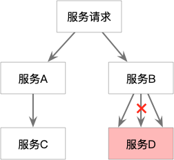
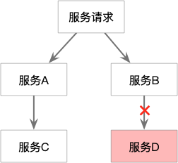

# 服务降级

什么是服务降级？当服务器压力剧增的情况下，根据实际业务情况及流量，对一些服务和页面有策略的不处理或换种简单的方式处理，从而释放服务器资源以保证核心交易正常运作或高效运作。

服务降级主要用于什么场景呢？当整个微服务架构整体的负载超出了预设的上限阈值或即将到来的流量预计将会超过预设的阈值时，为了保证重要或基本的服务能正常运行，我们可以将一些 **不重要** 或 **不紧急** 的服务或任务进行服务的 **延迟使用** 或 **暂停使用**。使得某些不重要的服务优先级降低。

当我们去秒杀或者抢购一些限购商品时，此时可能会因为访问量太大而导致系统崩溃，此时开发者会使用限流来进行限制访问量，当达到限流阀值，后续请求会被降级；降级后的处理方案可以是：排队页面（将用户导流到排队页面等一会重试）、无货（直接告知用户没货了）、错误页（如活动太火爆了，稍后重试）。

# 限流

服务B对服务D的请求数量太多，限流则可以限制一定时间的访问量，对于多余的请求直接拒绝，并返回设定好的策略。

## 限流指标

+ TPS：系统吞吐量。按照事务的完成数量来限流。

> 但是实操性较低。在分布式场景下，一个事务的完成可能要配合多个服务完成，时间粒度就会很大，很难准确评估系统的响应速度。

+ HPS：每秒请求数。每秒钟服务端收到客户端的请求数量。

> 如果一个请求完成一笔事务，那么HPS = TPS。但是在分布式场景下，一个事务的完成往往需要多次请求

+ QPS：服务端每秒能够响应的客户端请求数量。

> 如果后台只有一台服务器，那么HPS = QPS。但是在分布式场景下，每个请求需要多个服务器配合完成响应。

# 熔断

服务熔断的作用类似于我们家用的保险丝，当**下游某服务出现不可用或响应超时**的情况时，为了防止整个系统出现雪崩，**暂时停止**对该服务的调用。

上面的解释中有两个很关键的词，一个是暂时，一个是停止。  
停止是说，当前服务一旦对下游服务进行熔断，当请求到达时，当前服务不再对下游服务进行调用，而是**使用设定好的策略(如构建默认值)直接返回**。

暂时是说，**熔断后，并不会一直不再调用下游服务，而是以一定的策略(如每分钟调用 10 次，若均返回成功，则增大调用量)试探调用下游服务，当下游服务恢复可用时，自动停止熔断**。

# 三者的关系

| 措施 | 产生原因               | 针对服务 | 动作                         | 
| ---- | ---------------------- | -------- | ---------------------------- |
| 降级 | 自身服务的处理能力不够 | 自身服务 | 关闭非核心业务               |
| 限流 | 上游服务请求增多       | 上游服务 | 拒绝多余的请求               |
| 熔断 | 下游服务不可用         | 下游服务 | 不再调用，一段时间后进行试探 |

# 使用Sentienl

使用Sentinel来进行限流和熔断。同时Sentinel提供了dashboard可以更直观的看到效果。