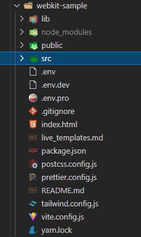
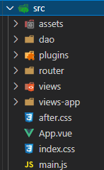

# 项目结构说明

使用vite构建，样式用tailwindcss。



+ node_modules

安装node后，用来存放包管理工具(npm,yarn)下载的包的文件夹。

```shell
npm install

yarn install
```

+ public

存放静态资源服务的文件夹。

+ src

源码文件夹，vue相关。

+ index.html

整个项目页面的基本框架。

+ package-lock.json
+ package.json

都记载了所需依赖模块的相关信息。在一个项目中安装依赖完成后，才会生成lock.json文件。如果发现项目中有lock文件，就会根据lock文件来安装依赖。主要是确保移植时能够安装相同的依赖。有时也是yarn.lock。

+ postcss.config.js

postcss是一个用js工具和插件转换css代码的工具。具体来说就是使得css的使用更加便利。提供许多插件。在这进行配置。

+ tailwind.config.js

对tailwindcss进行一些自己需要的自定义配置。诸如：主题，间距，颜色等。详情参考官方文档。

+ vite.config.js

对使用vite构建的vue项目的一些配置信息。

其中重点讲讲src文件。



+ assets,dao,plugins,router,views,views-app等根据文件夹名称就大致可以知道是干什么的。


+ App.vue

可以说是整个vue项目的根组件。

+ index.css

定义了整个项目会用到的css，在main.js中导入。

+ main.js

项目的入口文件。主要有三个作用。
1. 实例化Vue(从App.vue)。
2. 放置项目常用的插件和css样式(导入index.css)。
3. 存储全局变量


# 项目文件和页面对应关系

安装依赖，在安装了node和yarn后，运行命令。

```shell
yarn install
```

启动项目

```shell
yarn dev
```

根据地址打开页面，项目启动成功。


## index.html

检查页面结构


```html
<!DOCTYPE html>
<html lang="en" translate="no">
  <head>
    <meta charset="UTF-8" />
    <meta name="viewport" content="width=device-width, initial-scale=1.0" />
    <script>
      if (!!window.ActiveXObject || "ActiveXObject" in window) {
        alert("当前浏览器不支持，请使用360浏览器极速模式或谷歌浏览器等现代浏览器");
      }
      // todo https://github.com/vitejs/vite/issues/2618
      window.global = window;
    </script>
    <script type="text/javascript" src="https://gosspublic.alicdn.com/aliyun-oss-sdk-6.17.1.min.js"></script>
    <title>Vite App</title>
  </head>
  <body>
    <div id="app"></div>
    <script type="module" src="/src/main.js"></script>
  </body>
</html>
```

可以发现，整个页面的基础框架是在index.html中定义的。区别在于 `<div id = "app"></div>` 下的内容。app是整个vue项目的根组件。

利用Vue.js devtools浏览器插件进行查看，该页面下的Vue文件内的结构。


## App.vue


```js
<template>
  <el-config-provider :locale="zhCn">
    <router-view/>
  </el-config-provider>
</template>
<script setup>
import {zhCn} from "element-plus/lib/locales"
</script>
```

可以发现 `<div id = "adpp"></div>` 下的内容，实际就是App.vue这个根组件的内容。为了使组件可以在页面中进行展示，那么就需要将组件挂载到DOM才行，这一步的操作就在main.js中完成。index.html中也早已对main.js进行了调用。

```js
import {createApp} from "vue"
import App from "./App.vue"
import "./index.css"
import {useWebkit} from "./plugins/webkit"

const app = createApp(App)
useWebkit(app)

app.config.productionTip = false
app.mount("#app")
```

先看import
第一个：从vue中导入createApp()这个方法。
第二个：从App.vue导入App。
第三个：导入index.css，样式文件。
第四个：导入useWebkit。用于全局注册lib内的组件。

[import 和 import {}的不同](##import%20和%20import{})

创建一个App的Vue实例，并在该实例内全局注册lib内的组件。并挂载到 `id = "app"`的DOM上，也就是index.html里的 `<div>` 上。

至此，已经明白了整个项目的基础框架是怎么样的。

具体的不同的页面跳转就在Vue.app内的`<router-view/>`内实现。

# Router 路由

`<router-view/>`：当路由的path与访问地址相符合时，会将指定的组件来替换 `<router-view>`。

那么同样地，它是怎么读取到的呢？

这就还是要定位到`main.js` 下所使用的 `useWebkit()` 方法。

它的定义如下

```js
export function useWebkit(app) {
    
  configKitInit(import.meta.env)
    
  // 全局注册lib组件
  app.use(VueEcharts)
  app.use(KitEmpty)
  app.use(KitModal)
  app.use(KitTable)
  app.use(KitIcon)
  app.use(KitPaginationPage)
  app.use(KitRichText)
  app.use(KitUpload)
  app.use(KitFabricShow)
  app.use(KitGantt)

  // element 全局导入icon
  for (const [key, component] of Object.entries(ElementPlusIconsVue)) {
    app.component(key, component)
  }

  // router
  const router = _useRouter(app, routes)//使用路由配置
  //路由拦截
  router.beforeEach(routeBaseBefore)    //前拦截，即访问前需要做什么
  router.afterEach(routeBaseAfter)      //后拦截，即访问后需要做什么
}
```

这个函数相当于对传入的应用，注册了全局组件，导入了icon，还使用了路由。

然而在`main.js`中，传入的就是根组件。

```js
import {createApp} from "vue"
import App from "./App.vue"
import "./index.css"
import {useWebkit} from "./plugins/webkit"

const app = createApp(App)
useWebkit(app) 

app.config.productionTip = false
app.mount("#app")
```

所以，整个应用的路由关系就在router/index.js中进行了定义。包括每个路由对应的页面。


可以看到`<router-view/>`下面多了一个`<KitLayoutAdmin/>`。这就是原来App.vue下的 `<router-view>` 被替换了的证明。

组件和页面的联系


+ KitLayoutAdmin：整个页面的布局。
    + ElMenu：左侧的导航栏。
    + KitIcon：导航栏右侧的图标。
    + KitIcon：右上角个人头像的图标。
    + ElDrawer：点击右上角头像后，会弹出的个人中心的页面。
    + RouterView：页面的主体，选择不同的选项卡，会显示的内容。

会发现这里也出现了`<router-view/>`，那么两个`<router-view/>`，如何根据路径来选择，哪个组件下显示什么内容呢？

可以发现两个`<router-view/>`是一个层级嵌套的父子关系，那么在路由配置的文件中，也要根据父子关系进行配置即可。

```js
  // web
  {
    //一级路由
    path: "/",                  //匹配什么路径，根路径
    name: RouteName.index,      //路由的name
    redirect: {name: "page1"},  //重定向
    component: () => import("../../lib/components-layout/kit-layout-admin.vue"),                  //该路由下要展示的页面
    meta: {                     //路由元信息
      menu: true,
      authDisable: true,
    },

    children: [
      {
        path: "/page1",
        name: "page1",
        component: () => import("../views/page1/page1.vue"),
        meta: {
          menuTitle: "子页面1",
          menuIcon: "fee",
        },
      },
      //其他的二级路由
      {...},
    ]
```

children内的对象，就是路由配置。

如果需要更多层的嵌套，在children内再配置children即可。

## meta

定制的一些字段属性。定制的内容放在RouteMetaKey中。

```js
// route meta中的定义字段

export const RouteMetaKey = {
  menuIcon: "menuIcon", // 图标信息
  authFunc: "authFunc", // 访问权限，return bool
  authDisable: "authDisable", // 禁用登录拦截
  menuTitle: "menuTitle",
  menuBelong: "menuBelong", // 值为父menu的名称，将以此作为字段划分到group
  menuEx: "menuEx", // bool, 不纳入menu
  menuTreeIndex: "menu", // bool, 表示此主路由将用于menu数据
  menuAppTreeIndex: "menuApp", // bool, 表示此主路由将用于app-menu数据
  menuAppIndex: "menuAppIndex", // bool, 表示app-menu的主菜单之一
  parentName: "parentName", // 用于子页面，所属的菜单中的父页面（主要用于menu active显示）
}
```

通过使用以下方法来调用router里的meta。

```js
router.meta[RouteMetaKey.menuIcon]
```

# 接口请求


# 项目具体问题

## import 和 import{}

+ import：将文件做为一个整体导入。

import xxx from "path" :xxx的命名自己随意设定即可。

+ import{}：导入文件的某一部分或某些部分。需要在js中export才能import。

import {xxx} from "path"：

> path： "@xx" @等价于/src。


## export 和 export default

在js文件中对需要导入的变量，方法，常量，模块等使用export。

一个文件export default只能有一个，export可以有多个。

+ export的内容，在import时，必须用{name}，name就是在js中定义的名称。

+ export default的内容，import时，使用任意名称接受即可。

## import {xxx as yyy} from "path" 文件夹

`as`用于把引入的模块给予一个别名，通常用于 `export`出来的内容。名称不能任意确定，但可以给一个别名。

`"path"`，有时path路径指向的不是具体的文件，而是一个文件夹。

```js
if(package.json存在 && package.main字段存在 && package.main指定的js存在) {
    取package.main指定的js作为from的来源，即使该js可能格式或内容错误
} else if(index.js存在){
    取index.js作为from的来源
} else {
    取index.vue作为from的来源
}
```

默认导入pakage.json下定义过的main字段指定的名称，否则就导入index.js，最后找index.vue。

## setup 语法糖

语法糖：不是一种新的语法，只是帮助简化原语法的操作。这种语法对语言的功能并没有影响，但是更方便程序员使用。通常来说使用语法糖能够增加程序的可读性，从而减少程序代码出错的机会。

正常组件选项 `setup()`

```js
<script>
import { defineComponent, ref } from 'vue' 
import ComponentA from '@/components/ComponentA' 
import ComponentB from '@/components/ComponentB' 
export default defineComponent({ 
    name: 'HelloWorld', 
    components: { ComponentA, ComponentB }, 
    props: { msg: String, }, 
    setup(props, ctx) {
        const count = ref(0) 
        function add() { count.value++ } 
        // 使用return {} 把变量、方法暴露给模板 
        return { count, add, } }, }) 
    </script>
```

原本需要把变量方法暴露后，才能在 `<template>`中使用。

改成使用`setup`语法糖后

```js
<script setup>
import { ref } from 'vue' 
// 外部引入的方法，不需要通过 methods 选项来暴露它，模板可以直接使用 
import { getToken } from './utils' 
// 外部引入的组件，不需要通过 components 选项来暴露它，模板可以直接使用 
import ComponentA from '@/components/ComponentA' 

defineProps({ msg: String }) 
// 变量声明，模板可以直接使用 
const count = ref(0) 
// 函数声明，模板可以直接使用 
function add() { count.value++ } 
</script>
```

-   每个 `*.vue` 文件最多可同时包含一个 `<script>` 块 (不包括`<script setup>`)；
-   每个 `*.vue` 文件最多可同时包含一个 `<script setup>` 块 (不包括常规的 `<script>`)；

当然还有一些其他的使用也有区别，这里只是阐述了基本的使用区别。

## 使用第三方组件却没有导入和注册？

使用了"unplugin-vue-components"等一些可以自动插入组件的插件。
