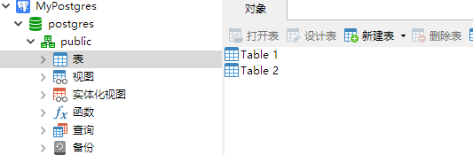
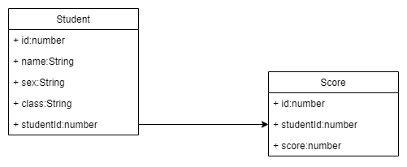

# 相关介绍

最早的时候，通常把数据存储在外部文件中。但是文件的打开很慢，查找也很慢。后来出现了数据库，也就是一种实现数据存储查找的解决方案。

数据库管理系统有很多种，MySQL，PostgreSQL等。它们并没有什么很大的区别，功能都是存储数据罢了，只是在性能上各有优劣。

最简单的理解，把数据存放在数据库中，可以更快实现增删查改，提高效率。

# 相关概念

先阐述大概的结构，里面有些概念稍后介绍。

数据管理系统通常需要部署在服务器上，可以是本地也可以是云端。

通过账户和密码登录后，就可以连接上数据管理系统。

数据管理系统下，存放着若干个数据库，每个数据库下管理着若干个模式，模式内管理着若干个数据表。

## 数据管理系统

开发好的系统，用于管理数据库。例如MySQL，PostgreSQL等。

## 数据库

数据库，是一个仓库，包含着许多的数据表。数据表以不同的模式进行分类。

## 模式

模式的存在可以说是为了多人协作而生的。假设一种情况， 多人共用一个数据库，但是每个人都需要建立一张同名的表，例如：student。那么在实际使用下，就不知道如何在多张同名表中找到属于自己的了。所以，数据库默认是不能有同名表格。于是就有了模式。将不同的用户进行区分，在各自的模式下，拥有属于自己的表。当然一般情况下，模式采用默认的public。

## 数据表

每个模式下，可以存储若干个数据表，表内就填写着各种数据。

## 数据

数据表内的一行表示一条数据，或者也可以叫记录。

## 字段

每条数据里可以存在若干个字段，根据字段的名称来区分填入的信息是什么。例如name，id，score等。

对字段信息的数据类型的支持有：字符串，数值，日期和时间，NULL，布尔值。

[数据类型](#数据类型)

## 主键

由于存在大量数据，如何使数据在表内唯一？主键就是标识，通常以id命名，在表内唯一，通过id来区分数据。当然也可以存在多个主键

> MyPostgres下有一个Postgres的数据库，有一个名为public的模式，下有两个表，Table1 和 Table 2。

# 重点理解

## 联结

实际使用情况下，表与表之间的关系并非独立的，而是互相关联的。

例如有两个表，一个为student，存储诸如学号，姓名等基本人物信息。第二张表为score，存储每个人的考试成绩等。通常情况下使用学号作为两者之间的桥梁。也就是说，两张表内含有同样的字段--学号。

结构关系如何所示。

# 数据类型

例举一些常用的类型。

| 类型      | 分类     | 长度   | 描述                                            |
| --------- | -------- | ------ | ----------------------------------------------- |
| integer   | 数值类型 | 4字节  | 常用整数                                        |
| serial    | 数值类型 | 4字节  | 自增整数，通常用于主键id，唯一                  |
| money     | 货币类型 | 8字节  | 货币金额，可由int，bigint转换，不建议使用浮点数 |
| char      | 字符类型 | 定长   | 不足补空白                                      |
| varchar   | 字符类型 | 变长   | 有长度限制                                      |
| text      | 字符类型 | 变长   | 无长度限制                                      |
| timestamp | 日期类型 | 8字节  | 日期和时间                                      |
| date      | 日期类型 | 4字节  | 只适用日期                                      |
| interval  | 时间类型 | 12字节 | 时间间隔                                        |
| boolean   | 布尔类型 | 1字节  | true/false                                      |
| Json      | Json类型 |        | {"key":"value"}                                                |

