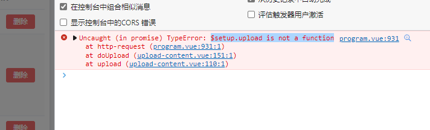

# web

## 教学管理

### 评分管理

- [ ] /rest/program/report/allScore             AllScore 接口
- [ ] /rest/knowledge/test/answer/score    TestAnswerScore接口
- [ ] 实训项目报告 打包下载

### 临时文件管理

- [ ] InClassTempFileList 有问题，不能正确返回文件列表

### 实验项目管理
- [ ] 新建项目前上传附件
- [ ] 新建的项目无法上传附件，刷新后才能上传。

# app

新建项目后，直接上传附件会报错

并且没有调用 上传文件 的接口。

但是浏览器刷新之后，就可以正常使用了。并且没有报错。
